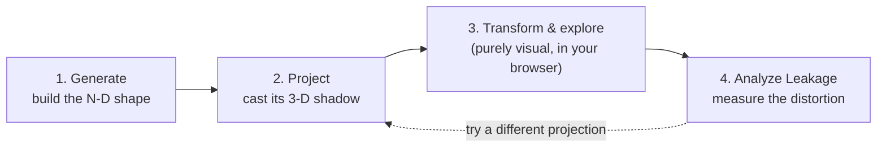
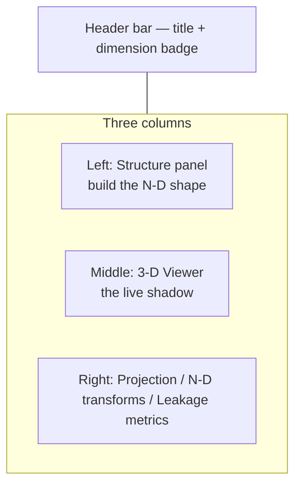

# Beginner's Tutorial: N-D Projection Studio

This tutorial assumes **no prior background** — not in higher-dimensional
geometry, not in linear algebra or statistics, and not in running a Python
web app from a terminal. Every concept is explained from first principles
before it's used. If you already know what a "projection matrix" or a
"virtual environment" is, you can skim or skip ahead; if you don't, read
every section in order.

Two other docs exist alongside this one, for later:

- [README.md](../README.md) — short feature list and quick-start commands.
- [docs/ui-controls.md](ui-controls.md) — the exhaustive, control-by-control
  technical reference, including every edge case and quirk. Come back to
  this once you're comfortable and want precise details.

This tutorial is the bridge between "I've never seen this app before" and
"I'm ready to read the exhaustive reference."

## Contents

- [Beginner's Tutorial: N-D Projection Studio](#beginners-tutorial-n-d-projection-studio)
  - [Contents](#contents)
  - [Part 1 — The big idea](#part-1--the-big-idea)
    - [1.1 What's a "dimension", really?](#11-whats-a-dimension-really)
    - [1.2 What does "projecting" mean?](#12-what-does-projecting-mean)
    - [1.3 Why projections lie (the shadow problem)](#13-why-projections-lie-the-shadow-problem)
    - [1.4 What this app actually does, in one sentence](#14-what-this-app-actually-does-in-one-sentence)
  - [Part 2 — Installing and running the app](#part-2--installing-and-running-the-app)
    - [2.1 What you need first](#21-what-you-need-first)
    - [2.2 A few words on what you're about to type](#22-a-few-words-on-what-youre-about-to-type)
    - [2.3 One-time setup](#23-one-time-setup)
    - [2.4 Running the server](#24-running-the-server)
    - [2.5 Opening the app](#25-opening-the-app)
    - [2.6 Stopping the server](#26-stopping-the-server)
    - [2.7 Troubleshooting setup problems](#27-troubleshooting-setup-problems)
  - [Part 3 — A guided tour of the screen](#part-3--a-guided-tour-of-the-screen)
  - [Part 4 — Your first five minutes](#part-4--your-first-five-minutes)
  - [Part 5 — Structures explained](#part-5--structures-explained)
  - [Part 6 — Projections explained](#part-6--projections-explained)
  - [Part 7 — N-D transforms explained](#part-7--n-d-transforms-explained)
  - [Part 7b — Position explained](#part-7b--position-explained)
  - [Part 7c — Saving and loading presets](#part-7c--saving-and-loading-presets)
  - [Part 8 — Leakage metrics explained](#part-8--leakage-metrics-explained)
  - [Part 9 — Guided exercises](#part-9--guided-exercises)
    - [Exercise 1 — Warm up with something you already understand](#exercise-1--warm-up-with-something-you-already-understand)
    - [Exercise 2 — Make it tumble](#exercise-2--make-it-tumble)
    - [Exercise 3 — Compare projection methods on the same shape](#exercise-3--compare-projection-methods-on-the-same-shape)
    - [Exercise 4 — Catch a projection actually lying to you](#exercise-4--catch-a-projection-actually-lying-to-you)
    - [Exercise 5 — One of the most famous shapes in mathematics](#exercise-5--one-of-the-most-famous-shapes-in-mathematics)
    - [Exercise 6 — The reproducibility gotcha](#exercise-6--the-reproducibility-gotcha)
  - [Part 10 — Common beginner mistakes](#part-10--common-beginner-mistakes)
  - [Part 11 — Glossary](#part-11--glossary)
  - [Part 12 — Where to go next](#part-12--where-to-go-next)

---

## Part 1 — The big idea

### 1.1 What's a "dimension", really?

Forget equations for a second. A dimension is just **an independent
direction you're allowed to move in**.

- A dot has no directions to move in: **0 dimensions**.
- Let it slide back and forth: you've traced out a line: **1 dimension**.
- Take that line and slide it sideways (a *new* direction, perpendicular to
  the first): you sweep out a square: **2 dimensions**.
- Take the square and slide it "up" (a third direction, perpendicular to
  both previous ones): you sweep out a cube: **3 dimensions**.

Nothing stops the pattern here. Take the cube and slide it along a
*fourth* direction — one that's perpendicular to all three you already
have — and you sweep out a shape called a **tesseract** (a 4-D hypercube).
You can keep going: 5, 6, 12 dimensions, each one just "one more
independent direction, at right angles to all the others."

The catch: **you cannot picture a fourth perpendicular direction.** Your
brain (and your monitor) are built for 3. This isn't a failure of
imagination — it's a hard physical limit of 3-D space itself. Nobody can
"just visualize" 6-D. What people actually do — and what this app does for
you — is look at a lower-dimensional *shadow* of the higher-dimensional
object instead.

### 1.2 What does "projecting" mean?

Hold your hand up between a lamp and a wall. The wall shows a 2-D shadow of
your 3-D hand. That shadow is a **projection**: a systematic way of
squashing a higher-dimensional object down into fewer dimensions, by
picking directions to keep and discarding (or mathematically combining
away) the rest.

This app does exactly that, just starting from 4–12 dimensions instead of
3, and landing on 3 dimensions (which your screen, and Three.js/WebGL,
*can* draw) instead of 2. Everything you'll see on screen is a "shadow" —
a 3-D projection of a structure that actually lives in more dimensions than
you can see directly.

### 1.3 Why projections lie (the shadow problem)

Shadows are useful, but they throw information away, and thrown-away
information can make two very different things look the same. Hold your
hand with fingers spread wide, pointing straight at the lamp: the shadow on
the wall can shrink down to a small, boring blob, even though your hand
takes up a lot of 3-D space. Two of your fingertips that are actually far
apart in 3-D can end up landing right on top of each other in the 2-D
shadow, purely because of the angle.

The exact same thing happens going from, say, 8 dimensions down to 3:

- Points that were **far apart** in the real, 8-D structure can **project
  on top of each other** in 3-D (they look like they're touching or
  overlapping, but they aren't, really).
- Points that were **each other's nearest neighbors** in 8-D can end up
  looking **far apart** in the 3-D view.
- A point that looked like it was safely inside a cluster can appear to
  "leak" outside it, or vice versa.

None of this is a bug in the app — it's an unavoidable, *mathematical*
consequence of throwing away dimensions, no matter how clever the
projection method is. Some methods distort less than others for a given
shape, and the whole point of the **Leakage metrics** panel
(see [Part 8](#part-8--leakage-metrics-explained)) is to put an actual
number on exactly how much a specific projection is lying to you, right now,
for the specific structure and viewpoint on your screen.

### 1.4 What this app actually does, in one sentence

> You build a point cloud that genuinely lives in 4–12 dimensions, pick a
> mathematical recipe to cast its "shadow" into 3 dimensions so you can
> look at it and spin it around like any other 3-D object, and then — if
> you want — ask the app to measure exactly how much that particular
> shadow is distorting the truth.



The next parts walk through each of those four steps in detail. But first,
let's get the app running on your machine.

---

## Part 2 — Installing and running the app

### 2.1 What you need first

- **Windows** with **PowerShell** (this tutorial uses PowerShell commands;
  it's the default terminal that opens in VS Code on Windows).
- **Python 3.10 or newer** installed. If you're not sure whether you have
  it, open PowerShell and type:
  ```powershell
  python --version
  ```
  If you see something like `Python 3.11.4`, you're set. If you see an
  error like `python is not recognized...`, you need to install Python
  first (search "python.org downloads", get the Windows installer, and
  make sure you tick **"Add python.exe to PATH"** during setup).
- An internet connection **the first time** you open the app in a browser
  — the 3-D graphics library (Three.js) loads from a public CDN rather
  than being bundled in this repository.

You do **not** need to know anything about web development, FastAPI, or
NumPy/SciPy to use the app — those are just the tools running underneath.

### 2.2 A few words on what you're about to type

Two ideas will make the commands below make sense instead of feeling like
magic incantations:

- **Virtual environment (`venv`)**: a self-contained, disposable folder
  (here, named `.venv`) holding its own private copy of Python's package
  installer, isolated from anything else on your computer. Every Python
  project should get its own, so its dependencies never clash with another
  project's. Creating one is cheap and safe — worst case, you delete the
  `.venv` folder and start over.
- **`pip install -r requirements.txt`**: `requirements.txt` is a plain text
  list of every package this app needs (FastAPI, NumPy, SciPy, etc. — you
  can open [requirements.txt](../requirements.txt) and read it, it's just
  names and version numbers). This command reads that list and downloads
  every package into the `.venv` you just created.

### 2.3 One-time setup

Open PowerShell **in the project folder** (in VS Code: `` Ctrl+` `` opens
a terminal already there), then run these two commands, one at a time:

```powershell
python -m venv .venv
.venv\Scripts\python -m pip install -r requirements.txt
```

What to expect:
- The first command finishes almost instantly and silently — it just
  creates the `.venv` folder. Nothing printing is normal.
- The second command downloads and installs several packages and prints a
  lot of `Collecting...` / `Installing...` lines, finishing with something
  like `Successfully installed fastapi-... numpy-... scipy-...`. This can
  take a minute or two the first time.

You only need to do this **once** (or again if you ever delete `.venv`).

### 2.4 Running the server

Every time you want to use the app, run:

```powershell
.venv\Scripts\python run.py
```

You should see output ending in:

```
INFO:     Uvicorn running on http://127.0.0.1:8000 (Press CTRL+C to quit)
...
INFO:     Application startup complete.
```

That means it's working — a small local web server is now running on your
own machine (nothing is sent over the internet except the one-time
Three.js download mentioned above). Leave this terminal window open; the
server keeps running as long as it's open.

> **Why type `.venv\Scripts\python` every time instead of just `python`?**
> It guarantees you're using the isolated copy of Python (with the
> packages you just installed) rather than whatever `python` happens to
> mean elsewhere on your system. This is the simplest, most foolproof
> option and matches every command in this tutorial and the README.
>
> If you'd rather just type `python` for the rest of the session, you can
> **activate** the virtual environment once per terminal:
> ```powershell
> .venv\Scripts\Activate.ps1
> ```
> On a default Windows setup this often fails with a message about running
> scripts being disabled on the system. That's PowerShell's execution
> policy blocking `.ps1` scripts by default — a security default, not a
> bug. Fix it for just the current terminal window (safe, does not change
> anything system-wide or permanent) with:
> ```powershell
> Set-ExecutionPolicy -Scope Process -ExecutionPolicy RemoteSigned
> ```
> then re-run the `Activate.ps1` line above. You'll see your prompt gain a
> `(.venv)` prefix once it's active.

### 2.5 Opening the app

With the server running, open a browser and go to:

```
http://127.0.0.1:8000/
```

You should see a dark-themed page with three columns: a **Structure**
panel on the left, a black 3-D viewport in the middle, and a **Projection
/ N-D transforms / Leakage metrics** panel on the right. If the middle
viewport is empty/black, give it a second — it needs that one-time Three.js
download from the internet.

### 2.6 Stopping the server

Click into the terminal running the server and press **Ctrl+C**. Closing
the terminal window works too.

### 2.7 Troubleshooting setup problems

| Symptom | Likely cause / fix |
|---|---|
| `python : The term 'python' is not recognized...` | Python isn't installed, or wasn't added to PATH. Reinstall from python.org and tick "Add python.exe to PATH". |
| `pip install` fails partway with a network/SSL error | Usually a flaky connection or a corporate proxy/firewall. Try again; if it keeps failing on a work machine, ask about a pip proxy configuration. |
| Running `run.py` prints an error mentioning the port, e.g. `error while attempting to bind on address ('127.0.0.1', 8000)` | Something else (maybe an earlier copy of this same server) is already using port 8000. Find and close that terminal, or close that program, then try again. |
| The browser tab just says "can't reach this page" | The server isn't running (check the terminal), or you mistyped the address — it must be exactly `http://127.0.0.1:8000/`. |
| The 3-D viewport stays permanently black | No internet connection for the one-time Three.js CDN load. Connect to the internet and refresh. |
| `Activate.ps1 cannot be loaded because running scripts is disabled` | See the execution-policy note in [2.4](#24-running-the-server) — or just skip activation entirely and keep using the full `.venv\Scripts\python ...` command form. |

---

## Part 3 — A guided tour of the screen



- **Header bar** (top): the app title, the named **Preset** controls, and a small **dimension badge**
  (e.g. "dimension: 6") — this is a read-only display of how many
  coordinates each point currently has. It only updates after a
  successful **Generate**.
- **Structure panel** (left): choose *what shape* to build in N-D and
  click **Generate**.
- **3-D Viewer** (middle): the live shadow. Left-drag to orbit the camera,
  scroll to zoom, right-drag to pan. These camera moves only change your
  *viewpoint* — they never touch the underlying N-D coordinates.
- **Projection panel** (top-right): choose *how* to cast the shadow from
  N-D to 3-D, then click **Apply Projection**.
- **N-D transforms** (mid-right): rotate coordinate planes or scale one axis,
  purely as a visual, in your browser.
- **Position** (mid-right, just below N-D transforms): shift the N-D
  structure itself sideways, one slider per axis — also purely visual.
- **Leakage metrics** (bottom-right): click **Analyze Leakage** to get
  real numbers on how much the current shadow is distorting the truth.

Every control also has its own built-in tooltip — hover over any label,
button, or field for a few hundred milliseconds and a short explanation
pops up. That's a good habit to build early: **if you're ever unsure what
something does, hover over it before touching it.**

---

## Part 4 — Your first five minutes

Follow these steps exactly once, just to see the whole loop work
end-to-end, before we explain *why* each piece behaves the way it does.

1. Load the page. It already has sensible defaults and generates a
   structure automatically, so you should immediately see a glowing dot
   cloud in the viewer (a default **Hypersphere / Spherical Code** in
   6 dimensions).
2. **Left-drag** inside the viewer. The camera orbits around the shape.
   This proves it's a real, rotatable 3-D object on your screen — even
   though it's secretly a projection of something 6-dimensional.
3. Look at the dimension badge in the header. It should read `dimension: 6`.
4. In the **Structure** panel, change **Type** to **Hypercube**, leave
   everything else, and click **Generate**. You should now see a cube-like
   wireframe (in 5-D by default for this type) replace the previous dot
   cloud, and the dimension badge should update to `5`.
5. In the **Projection** panel, change **Method** to
   **PCA (top 3 principal components)** and click **Apply Projection**.
   The shape reorients slightly — same points, different "photo angle."
6. In **N-D transforms**, you should already have one row. Drag its speed
   slider around and watch the structure visibly tumble.
7. Click **Analyze Leakage**. A handful of metric groups appear at the
   bottom, each with a number. Don't worry about what they mean yet —
   [Part 8](#part-8--leakage-metrics-explained) covers each one.

If all seven steps worked, the app is fully functional on your machine.
The rest of this tutorial is about understanding *what you just did*.

---

## Part 5 — Structures explained

The **Structure panel**'s job is to build a set of points that genuinely
live in N dimensions (4 to 12, chosen per structure). Every option below
is a `Type` choice in that panel.

| Type | What it actually is | Why you'd pick it |
|---|---|---|
| **Hypersphere / Spherical Code** | Points constrained to the surface of an N-D "beach ball" (every point the same distance from the center). `mode: spherical_code` nudges points apart from each other (a physics-like repulsion simulation) so they spread out evenly, like a fair dot pattern on a ball; `mode: random` just scatters them with no such nudging, so some clumping is normal. | The friendliest, most "generic sphere-like" shape — a good default for comparing projection methods. |
| **Hypercube** | The N-D generalization of a square (2-D) / cube (3-D): `2^n` corners, one at every combination of `+edge/2` or `-edge/2` in each coordinate. Edges connect two corners that differ in exactly **one** coordinate's sign. | The most intuitive shape to start with — you already know what a cube looks like, so you can *feel* what information the projection keeps or loses. Watch the corner count double every time you raise the dimension by 1. |
| **Cross-Polytope (Orthoplex)** | The "opposite" of a hypercube: just `2n` points, one pair of points per axis, each sitting at `+radius` and `-radius` along that one axis only (all other coordinates zero). In 3-D this is an octahedron. | A minimal, maximally axis-aligned shape — useful for seeing exactly what an *orthogonal* projection (below) does, since these points are already sitting *on* individual axes. |
| **Root System D_n** | Every vector with exactly two nonzero coordinates, each `+1` or `-1` (so, `2n(n-1)` points total). This comes from an area of mathematics called Lie theory / root systems, used in crystallography and coding theory. | Explore a mathematically "famous" symmetric family without needing to know the theory behind it. |
| **Root System E_n** | Related to **E_8**, one of the most celebrated symmetric structures in all of mathematics (240 points in 8 dimensions, with an enormous amount of internal symmetry). This app only supports dimension 6, 7, or 8, because E_6/E_7 are defined here as specific lower-dimensional slices of E_8. | Purely for the "wow" factor and to see a genuinely dense, highly symmetric point set — a great stress test for projection quality. |
| **Random Point Cloud** | No structure at all — just `num_points` points sampled from a `gaussian` (bell-curve, unbounded), `uniform_ball` (uniformly filled solid ball), or `uniform_cube` (uniformly filled solid box) distribution. | The "control group." Compare metrics/behavior here against a structured shape to see how much of what you observe is due to the *structure* versus just being generic high-dimensional data. |
| **Layered Sphere Packing** | Several concentric spherical-code "shells" (like Russian nesting dolls made of evenly-spaced dots), one shell per `num_shells`, spaced `radius_step` apart. Each shell gets its own color in the viewer. | See how a projection handles *layers* — does shell 1 still look clearly separated from shell 3 after projecting? |
| **Regular Simplex** | The N-D generalization of a triangle (2-D) / tetrahedron (3-D): `n + 1` points, every single pair the *exact same distance* apart. The simplest possible fully-symmetric shape. | The cleanest baseline for the **Rank-order distortion** metric, since every true pairwise distance starts out identical. |
| **Voronoi Neighborhood** | Takes a random cloud, picks one point (`center_index`), and works out exactly which other points are its genuine geometric neighbors in N-D (via Delaunay triangulation — an advanced computational-geometry technique). The chosen center point, its true neighbors, and everyone else are colored differently. Capped at dimension 4–8 and ~150 points because this computation gets slow/unstable beyond that. | The most direct way to test "did the projection preserve *true* local neighborhoods?" — you can visually check whether the highlighted neighbors still look adjacent after projecting. |
| **Clifford Torus** | A flat torus `S¹ × S¹` embedded in exactly 4 dimensions: one circle uses axes 0–1 and the other uses axes 2–3. Every point stays the same distance from the origin. `resolution_u` and `resolution_v` control the two wrapped sampling directions. | A clean demonstration of a surface that belongs naturally in 4-D rather than being a distorted 3-D doughnut. Rotate planes that mix its two axis pairs to reveal its hidden structure. |
| **Klein Bottle** | A closed, non-orientable surface embedded without self-intersection in exactly 4 dimensions. Its wireframe closes with the twisted identification `(2π, v) ~ (0, -v)`, so the final ring joins the first in reverse rather than leaving an open seam. | Compare a genuine 4-D embedding with familiar self-intersecting 3-D Klein-bottle pictures, and watch projection create apparent intersections that are not present in 4-D. |

> **Tip:** every structure type has its own set of extra number/dropdown
> fields (radius, point count, seed, etc.) that appear once you select it.
> Hovering each one shows its valid range and what it controls. Changing
> these fields does nothing by itself — you must click **Generate**
> afterward to actually build the new shape.

---

## Part 6 — Projections explained

The **Projection panel** decides *how* to cast the N-D point cloud's
shadow into the 3 numbers (X, Y, Z) that the viewer actually draws. Every
method below is a `Method` choice in that panel. Mathematically, most of
these work by multiplying every N-D point by a fixed 3×N matrix (think of
it as 3 "recipes," one per output axis, each recipe being a weighted blend
of the N input coordinates); the last two use a different, non-matrix
formula.

| Method | Plain-language explanation | When to reach for it |
|---|---|---|
| **Orthogonal (axis-aligned)** | Pick exactly 3 of the N coordinate axes (`axis_x`, `axis_y`, `axis_z`) and simply throw away all the others. The simplest possible "shadow": like photographing a cube from perfectly straight-on, so you only ever see 3 of its edges' directions. | Understanding what a single "slice" of the data looks like, or deliberately showing that most information lives in the axes you *didn't* pick. |
| **PCA (top 3 principal components)** | Automatically finds the 3 directions along which your *specific* point cloud happens to vary the most, and photographs from that angle — "the 3 most informative axes for this exact shape," recomputed from scratch every time you click Apply. (PCA = Principal Component Analysis, a standard statistics technique.) | The best general-purpose "make it look reasonable" choice — usually the least distorted-looking option for an arbitrary structure. |
| **Random Johnson–Lindenstrauss** | Builds a *random* 3×N recipe instead of a carefully chosen one, but one built by a specific mathematical formula (the Johnson–Lindenstrauss lemma) that comes with a proven guarantee: on average, across *many* points, relative distances are approximately preserved, no matter the shape. The `seed` field lets you get a different, but equally "safe," random angle; `orthonormalize` (on by default) keeps the 3 output directions at right angles to each other, avoiding a stretched/skewed look. | Comparing against PCA: does a "dumb but principled" random projection do noticeably worse than the "smart" one for this shape? A common technique in real-world machine learning for cheaply shrinking huge dimensional data. |
| **User-Defined Matrix** | You type your own 3×N matrix by hand as JSON (a text box, pre-filled with a simple example that just selects axes 0, 1, 2 — equivalent to Orthogonal). For total control once you understand the other methods. | Experimenting deliberately, e.g. blending two axes together in a custom way to see a specific effect. |
| **Perspective from N-space** | Mimics an actual camera: like real-world perspective where far-away things look smaller, this collapses the "extra" axes one at a time using a divide-by-distance formula, controlled by `camera_distance` (how far the virtual camera sits along each collapsed axis). Smaller distances exaggerate the effect; larger ones flatten it out toward looking orthogonal. | Seeing a more "photographic," less flat-looking rendering of the structure. |
| **Stereographic** | The classic trick mapmakers use to flatten a globe: imagine shining a light from one "pole" of the N-D sphere through every other point, out onto a flat surface on the opposite side. `pole_axis` picks which axis is the "pole" being collapsed this way (`-1` is a shortcut meaning "the last axis"); `radius` should usually match the structure's own radius. | Best paired with sphere-like structures (Hypersphere, Cross-Polytope) since the formula assumes points are roughly the same distance from the center. |

> **Remember:** changing the Method or its fields does **nothing** by
> itself — you must click **Apply Projection** to actually recompute and
> redraw the shadow. The one exception is right after you click
> **Generate**, which automatically re-applies whatever projection method
> is currently selected, so a brand-new structure is never left showing an
> outdated projection.

---

## Part 7 — N-D transforms explained

In 3-D, "rotating an object" means spinning it around an axis (the classic
X, Y, or Z axis — or really, around any single line through space). That
mental model **breaks down** once you have 4 or more dimensions: there
isn't one single natural "axis" left over once you fix an axis to spin
around in 4-D+ the way there is in 3-D.

The mathematically correct generalization is to rotate within a **plane**
— defined by picking any *two* of the coordinate axes — while every other
coordinate stays exactly where it is. In 3-D, "rotate around the Z axis"
is secretly the same thing as "rotate within the X–Y plane" — it's just
that in 3-D there's always exactly one axis left over once you pick a
plane, so the two ways of describing it happen to coincide. In 4-D there
are already 6 different possible plane choices (any 2 of 4 axes), and
higher dimensions have even more. Choose **Plane rotation** as the transform
type, then select one canonical unordered pair such as `axes 0–3`. Reversed
pairs are not duplicated: direction comes from the sign of Angle and Speed.

- Each row begins with a **Transform type**. Plane rotation uses one
  canonical unordered plane selector; Axis scale uses one axis selector.
  Targets already used by another row of the same type are omitted.
- Every row has its own **Speed** in whole degrees per second. Negative reverses
  direction or phase, and 0 holds that row at its current state. The precise
  slider covers `-30…30°/s`; the number box accepts `-120…120°/s` and rounds to
  a whole number on blur. Double-clicking the slider sets Speed to 0.
- You can stack up to **one row per dimension** at once (4 rows for a 4-D
  structure, up to 12 for a 12-D one); they combine into one compound
  transformation.
- Beneath Speed is an **Angle** box for Plane rotation or a **Phase** box
  for Axis scale, plus a small dial. While playing, the disabled box and dial
  are live readouts refreshed 10 times per second. Click **Pause** to type an
  exact degree value or drag the dial; double-click the dial to reset just
  that row to 0°. Generate and Reset transforms return every row to 0°.
- Choose **Axis scale** as the transform type to select one coordinate instead.
  Its phase produces the scale factor `cos(phase) + sin(phase)`. Positive values
  stretch that coordinate, zero collapses it, and negative values reflect it.
  This makes an effective dimension probe: watch features disappear as one
  coordinate collapses.
- This is purely a client-side visual effect in your browser — transform
  settings are **never sent to the server as parameters**. Only the resulting
  coordinates are sent, and only when you click Analyze Leakage.

Two things that surprise almost everyone the first time:

> **Transform type is explicit.** Plane rotation offers one unordered plane
> selector; Axis scale offers one axis selector and shows its live factor.
> Planes and scale axes already active in another row are omitted, preventing
> duplicate or reversed copies of the same transform target.

> **Pause vs. Reset transforms — two different buttons, two different
> jobs.** **Pause** (it relabels itself **Resume** once clicked) freezes
> the structure exactly wherever it currently is — every row's angle or phase is
> held in place, and clicking Resume continues tumbling from that same
> pose. **Reset transforms** is a separate button that always snaps every
> row back to its neutral state (rotation angle 0; Axis scale phase 0 and
> factor 1), discarding whatever transformed pose was showing. Position is
> unchanged. Use Pause for a
> screenshot or a reproducible Analyze Leakage reading; use Reset transforms
> if you actually want to start over.

---

## Part 7b — Position explained

N-D transforms rotate or scale the structure around its own coordinate origin.
Sometimes you want to **move** it too — shift the whole thing sideways
without changing those transforms. That's what the **Position** panel does:
one slider (plus a paired number box for typing an exact value) per
dimension, each shifting every point's coordinate on that one axis by a
fixed amount. Every frame, N-D transforms are applied first, *then* shifted
by these offsets, and only after that is it projected down to 3-D — so
Position and N-D transforms compose cleanly, in that order.

- Every axis starts at **0** (no shift) and resets to **0** automatically
  every time you click **Generate** — a fresh structure always starts
  centered, just as every transform starts at Angle/Phase 0.
- **Reset position** snaps every axis back to 0 without regenerating,
  exactly like **Reset transforms** does for angles and phases.
- With 4–12 sliders depending on the current dimension, the Position list
  scrolls independently once it gets tall — you don't need to scroll the
  whole right-hand panel just to reach Leakage metrics below it.
- This is purely a client-side visual effect, exactly like N-D transforms — the
  offset is never sent to the server as a parameter, only baked into
  whatever coordinates Analyze Leakage happens to capture.

> **A moved object usually measures identically in Leakage metrics — but
> not always.** Every metric in [Part 8](#part-8--leakage-metrics-explained)
> is built from *relative* distances or a self-computed center point, so
> for most projection methods, shifting the object changes nothing about
> the numbers — only *where* it sits on screen. The two exceptions are
> **Perspective** and **Stereographic**, which both divide by something
> derived from a point's raw distance from the origin — for those two
> methods specifically, moving the structure closer to or farther from the
> origin really can change how distorted it looks.

---

## Part 7c — Saving and loading presets

The Preset controls in the header save a complete, reproducible composition—not
just whichever panel happens to be visible. A preset includes the Structure type
and parameters, Projection method and parameters, ordered N-D transform rows and
their current Angle/Phase values, Position, camera view, and play/pause state.

- Choose **Save as…**, enter a unique name, and click Save. The new name becomes
  selected in the Preset dropdown.
- **Save** updates the selected named preset. When **Current session** is
  selected, Save asks for a name instead.
- Selecting a name loads it. Generation and projection are checked first; the
  visible scene changes only if both succeed. Every preset opens **paused**, so
  its exact saved pose is visible before animation resumes.
- A `•` after the selected name means the current controls, pose, position, or
  camera view differ from the saved preset. Save updates it; Save as creates a
  separate preset.
- The **⋯** menu provides Rename, Duplicate, Delete, Export selected, Export all,
  and Import.

Named presets live in this browser's `localStorage` for the exact site origin.
For example, `http://127.0.0.1:8000` and `http://localhost:8000` have separate
collections. The app also keeps a separate automatic **Current session** snapshot
and restores its last valid state after refresh. This automatic snapshot never
overwrites a named preset.

Use **Export selected…** to download one human-readable
`name.ndstudio.json` file, or **Export all…** for a complete backup. Import accepts
either format, validates its version and parameters, and offers **Replace**,
**Keep both**, or **Cancel import** when a name already exists. Browser storage is
the convenience copy; exported JSON is the portable backup for another browser,
profile, computer, or app origin.

---

## Part 8 — Leakage metrics explained

This is the payoff for everything above: a way to put an actual number on
"how much is this specific shadow lying to me, right now?" Click
**Analyze Leakage** and the app sends the exact points currently on screen
(including any live transform) to the server, which computes five
different kinds of distortion using SciPy. Each one catches a different
*flavor* of lie a projection can tell.

| Metric | What it actually measures | How to read the number |
|---|---|---|
| **Containment** | Draws an imaginary ball around the center containing the "middle 50%" of points (by distance from the centroid) — separately in N-D and in 3-D — then checks how many points that were inside that ball in N-D appear to have **leaked outside** it in 3-D (and vice versa: how many outsiders now look like they **leaked in**). | Both fractions are 0%–100%. Near 0% for both = the projection kept "who's core, who's fringe" honest. High numbers mean the shadow is seriously misrepresenting which points are central. |
| **Neighborhood inversion** | For every point, compares its actual 10 nearest neighbors in N-D against its 10 nearest neighbors in the 3-D shadow, using the fraction of overlap between those two neighbor sets (a similarity score called a **Jaccard index** — see the [glossary](#part-11--glossary)). Also separately counts **hard inversions**: cases where a point's single *closest* N-D neighbor ends up among the *farthest* 10% of points from it in 3-D — a true worst-case flip, not just minor reshuffling. | Inversion rate 0% = every point's neighbor set survived perfectly; higher = neighborhoods are getting scrambled. Any nonzero hard-inversion count is worth noticing — it means at least one genuine "these two are practically touching" relationship got turned into "these two are practically as far apart as possible." |
| **Projected overlap** | In N-D, most points are safely separated — imagine a small personal-space "bubble" (a *packing radius*, computed from how tightly the points are actually spaced) around each point, and check that no two bubbles touch. This metric counts how many of those genuinely-non-touching N-D pairs end up with visually **overlapping** bubbles after projecting to 3-D (after correcting for the fact that projections can shrink or stretch everything by some overall scale). | 0% = no false overlaps introduced. Higher percentages mean the 3-D view is visually cramming together points that were legitimately kept apart in the real structure — the single most direct number for "am I about to be visually misled about which points are distinct?" |
| **Rank-order distortion** | Takes *every* pair of points, measures their distance in N-D and their distance in 3-D, and asks: overall, does "closer in N-D" reliably mean "closer in 3-D"? This is computed with a standard statistics tool, the **Spearman rank correlation** (see [glossary](#part-11--glossary)). | Ranges from -1 to 1. **1.0** = perfect — the 3-D distances are ranked in exactly the same order as the N-D ones. **0** = no relationship at all between the two orderings. Negative would mean the projection is actively *reversing* the true distance order (rare, but possible with an adversarial projection). |
| **Adjacency preservation** | Builds a "who's-connected-to-whom" graph independently in N-D and in 3-D (connecting each point to its 6 nearest neighbors), then compares the two graphs: what fraction of connections survived in both (**edge Jaccard**), and how many separate, disconnected clusters (**connected components**) does each graph break into? | Edge Jaccard near 1.0 = the local connectivity structure was well preserved. If `components_nd` and `components_3d` differ, the projection is even changing the *coarse* shape of the data — e.g. merging two things that were genuinely separate, or splitting one connected cluster into pieces. |

If the point cloud has more than 400 points, the app automatically
computes these metrics on a random 400-point subsample for speed — the
readout tells you when this happened.

> **Why bother with five different metrics instead of one?** Because
> "distortion" isn't one single thing. A projection can preserve overall
> rank-ordering nicely (good Spearman r) while still creating a handful of
> severe local overlaps (bad Projected overlap) — these metrics are
> deliberately checking *different* failure modes, and a trustworthy-looking
> picture can still hide a bad number in one specific metric.

---

## Part 9 — Guided exercises

Do these in order — each one builds on an idea from the previous one.

### Exercise 1 — Warm up with something you already understand

1. **Structure → Type: Hypercube**, **Dimension: 4** → **Generate**.
   This is a tesseract: the 4-D generalization of a cube. Read
   `#structure-meta`'s vertex count (should be 16 = 2⁴).
2. Left-drag to orbit. Notice every edge connects two corners that differ
   in exactly one coordinate — same rule as a normal 3-D cube, just with
   one extra "flip-able" direction.
3. Change **Dimension** to 6, click **Generate** again, and watch the
   vertex count jump to 64 = 2⁶. Try 8 (256 vertices) if you like — notice
   how much busier the wireframe gets even though it's "the same shape."

### Exercise 2 — Make it tumble

1. With the hypercube still showing, go to **N-D transforms**. There's
   already one Plane rotation row, defaulted to `axes 0–1` — the app added it at page
   load, before you ever switched structures.
2. Drag its speed slider to about `12°/s` and watch it spin.
3. Click **+ Add transform**. The new Plane rotation uses the first
   canonical plane not already active, normally `axes 0–2`. Set its speed
   to about `-7°/s`. The two distinct plane rotations now compose in row order;
   because they share axis 0, the compound motion differs from two rotations
   acting on disjoint axis pairs.
4. Click **Pause**. Notice the structure freezes exactly where it was,
   and the button relabels itself **Resume** — click it again to keep
   tumbling from that same pose. Now try **Reset transforms** instead: this
   one *does* snap back to the just-generated orientation, discarding the
   current pose — the opposite of Pause.
5. Pause again, change the second row's **Transform type** to **Axis scale**,
   and drag its Phase dial. The row now stretches, collapses, and reflects one
   coordinate instead of rotating a plane; its live factor explains the effect.

### Exercise 3 — Compare projection methods on the same shape

1. **Structure → Type: Hypersphere / Spherical Code**, **Dimension: 6**,
   leave the rest default → **Generate**.
2. **Projection → Method: Orthogonal (axis-aligned)** → **Apply
   Projection**. This just shows raw axes 0, 1, 2 — 3 of the 6 coordinates,
   with the other 3 completely ignored.
3. Switch **Method** to **PCA (top 3 principal components)** → **Apply
   Projection**. Compare the shape — for spherical-code points (which are
   deliberately spread evenly), PCA and Orthogonal often look fairly
   similar, since there's no one "special" direction to find. Keep this
   comparison in mind for Exercise 4, where the difference will be much
   more dramatic.
4. Switch to **Random Johnson–Lindenstrauss**, change the **seed** field
   to a different number, and click **Apply Projection** a few times with
   different seeds — you're seeing different, equally "safe" random
   viewing angles.

### Exercise 4 — Catch a projection actually lying to you

This is the exercise that makes [Part 8](#part-8--leakage-metrics-explained)
click.

1. **Structure → Type: Random Point Cloud**, **Dimension: 8**,
   **num_points: 300**, **distribution: gaussian** → **Generate**. This
   cloud has no special structure — its "spread" is roughly the same in
   every one of its 8 directions.
2. **Projection → Method: Orthogonal (axis-aligned)**, leave axes at
   0, 1, 2 → **Apply Projection**. You are now looking at only 3 of 8
   coordinates, completely ignoring the other 5.
3. Click **Analyze Leakage**. Write down (or just remember) the
   **Rank-order distortion → Spearman r** value and the
   **Neighborhood inversion → k-NN inversion rate**. For an 8-D Gaussian
   cloud viewed through only 3 arbitrary raw axes, expect this to look
   noticeably imperfect — a middling Spearman r and a nontrivial inversion
   rate — since 5 of the 8 coordinates' worth of information was thrown
   away with no regard for where the data actually varies.
4. Now switch **Method** to **PCA** → **Apply Projection** → **Analyze
   Leakage** again. Compare the same two numbers. PCA automatically finds
   the 3 directions the data varies most along, so — unlike the arbitrary
   axis choice — it should preserve noticeably more of the true structure:
   expect a higher Spearman r and a lower inversion rate than step 3.
5. **Takeaway:** the "quality" of a projection isn't fixed — it depends on
   *both* the method *and* the specific shape you're projecting. This is
   exactly why the Leakage metrics panel exists instead of just trusting
   your eyes.

### Exercise 5 — One of the most famous shapes in mathematics

1. **Structure → Type: Root System E_n**, **Dimension: 8** → **Generate**.
   Check `#structure-meta` — it should report 240 roots. You're now
   looking at a shadow of the E_8 root system, a structure with an
   enormous amount of internal symmetry, central to several areas of
   advanced mathematics and physics.
2. Apply **PCA**, then **Analyze Leakage**. Because of how symmetric this
   structure is, see how the metrics compare to the Random Point Cloud
   from Exercise 4 — structured, symmetric data often (though not always)
   projects more faithfully than unstructured data of the same size.

### Exercise 6 — The reproducibility gotcha

1. With any structure and projection applied, make sure at least one
   N-D transform row has a nonzero speed and animation is **playing**
   (the button should read "Pause", not "Resume").
2. Click **Analyze Leakage** twice, a couple of seconds apart, without
   touching anything else. Notice the numbers are slightly **different**
   each time.
3. This is expected: Analyze Leakage always uses whatever transformed view is
   on screen *at the instant you click it* — not a fixed snapshot. Click
   **Pause** (freezing the current look exactly where it is, per
   [Part 7](#part-7--n-d-transforms-explained)) and click Analyze Leakage
   twice more — now the numbers should match exactly.

---

## Part 10 — Common beginner mistakes

| "It looks broken because…" | What's actually happening |
|---|---|
| "I changed a Projection field but the view didn't update." | You need to click **Apply Projection** — changing the method or its fields never redraws by itself (the one exception is immediately after Generate, which auto-applies). |
| "I changed a Structure field but the view didn't update." | Same idea — click **Generate**. Only Generate talks to the server for structure data. |
| "I set a custom camera distance or matrix, then clicked Generate again, and it reset!" | Expected: Generate rebuilds every Projection field from its schema defaults, including the custom matrix, and then auto-applies the selected method. |
| "I clicked Reset transforms expecting it to just pause, but my angle disappeared." | Reset transforms returns every Angle/Phase to 0; it is separate from **Pause**. Use Pause whenever you want to freeze the current state instead of discarding it. See [Part 7](#part-7--n-d-transforms-explained). |
| "I carefully positioned my structure, clicked Generate again, and my Position sliders all jumped back to 0." | Expected — Position always resets to 0 on every Generate, on purpose, just as all transform Angle/Phase values return to 0 for a new structure. See [Part 7b](#part-7b--position-explained). |
| "My two Analyze Leakage clicks gave different numbers for no reason." | You were animating — see Exercise 6. |
| "Generate failed with a validation error about `center_index`." | Only relevant to **Voronoi Neighborhood**: its `center_index` field's maximum (149) isn't automatically lowered when you pick a smaller `num_points`. Keep `center_index` below your chosen `num_points`. |
| "How do I stretch or collapse just one dimension?" | Set **Transform type** to **Axis scale**, choose the axis, and use Phase/Speed. Its live factor explains the stretch, collapse, or reflection. See [Part 7](#part-7--n-d-transforms-explained). |
| "I typed a value into an Angle/Phase box but nothing happened." | The box is a live readout while playing and editable while **paused**. Click Pause first, then type the exact value. See [Part 7](#part-7--n-d-transforms-explained). |
| "The dimension badge didn't update when I typed a new Dimension value." | It only updates after a **successful** Generate completes, reading the server's response — not from the field itself as you type. |
| "Tooltips seem slow/inconsistent." | Hover and hold still for about a quarter of a second directly over the label, button, or field (not just near it) — the tooltip fades in quickly but does need a brief, still hover to trigger. |
| "My presets disappeared when I changed from `127.0.0.1` to `localhost`." | Browser storage is scoped to the exact origin, so those addresses have separate preset collections. Return to the original address or export there and import the JSON at the new address. |

---

## Part 11 — Glossary

- **Dimension** — one independent direction of movement/variation. Our
  everyday world has 3; this app works with structures that have 4–12.
- **Point cloud** — a set of individual points (each one a list of N
  numbers, one per dimension) with no connecting surface, as opposed to a
  solid object.
- **Projection** — a systematic way of computing fewer coordinates (here,
  3) from more coordinates (here, 4–12), discarding or blending away the
  rest. Conceptually the same idea as a shadow.
- **Orthogonal projection** — the simplest projection: just keep 3 of the
  N coordinates as-is and ignore the others.
- **PCA (Principal Component Analysis)** — a statistics technique that
  finds the directions along which a specific data set varies the most,
  and uses those as the projection's 3 output directions.
- **Johnson–Lindenstrauss (JL) embedding** — a randomly generated
  projection that comes with a mathematical guarantee of only mildly
  distorting relative distances, on average, regardless of the input
  shape.
- **Perspective projection** — a camera-like projection where farther-away
  points shrink more, controlled by a virtual "camera distance."
- **Stereographic projection** — the classic "flatten a globe by shining a
  light through it from one pole" technique, generalized to N dimensions.
- **Rotation plane** — in dimensions above 3, "rotating" means spinning
  within a plane defined by *two* chosen axes, rather than around a single
  axis. See [Part 7](#part-7--n-d-transforms-explained).
- **Axis scale** — an animated single-coordinate transform whose factor is
  `cos(phase) + sin(phase)`. Positive values stretch, zero collapses, and
  negative values reflect that dimension. See [Part 7](#part-7--n-d-transforms-explained).
- **Position offset** — a fixed N-D vector added to every point, one
  slider per axis, shifting the structure without changing its
  orientation. Applied after N-D transforms and before projection, and resets
  to 0 on every Generate. See [Part 7b](#part-7b--position-explained).
- **Preset** — a named, versioned configuration stored in this browser. It
  captures structure, projection, transforms and phases, Position, and camera
  view. JSON export makes it portable. See
  [Part 7c](#part-7c--saving-and-loading-presets).
- **Root system** — a highly symmetric set of vectors studied in an area
  of mathematics called Lie theory; D_n and E_n (E_6/E_7/E_8) are two
  well-known families, included here for their symmetry and mathematical
  significance rather than any practical/engineering purpose.
- **Voronoi cell / Delaunay triangulation** — two mathematically dual ways
  of formally defining "which points are true geometric neighbors" of a
  given point in a scattered cloud. This app uses the Delaunay version to
  find a chosen point's genuine nearest-neighbor set.
- **Centroid** — the average position of a set of points; its "center of
  mass" if every point weighed the same.
- **k-nearest neighbors (k-NN)** — the *k* points closest to a given point.
  Used both to build the viewer's wireframe skeleton and in several
  Leakage metrics (comparing a point's neighbor set before vs. after
  projection).
- **Jaccard index** — a similarity score between two sets: (size of their
  overlap) ÷ (size of their combined union). 1.0 = identical sets, 0 = no
  overlap at all. Used here to compare neighbor sets and connectivity
  graphs before/after projection.
- **Spearman rank correlation / Kendall's tau** — statistics measuring how
  well the *order* of one list of numbers (here, N-D pairwise distances)
  matches the order of another list (3-D pairwise distances), from -1
  (perfectly reversed) through 0 (unrelated) to 1 (perfectly matching
  order).
- **Connected component** — a cluster of points that are all reachable
  from one another by hopping along "who's-connected-to-whom" edges; a
  graph with 1 connected component is "all one piece," more than 1 means
  it's split into separate islands.
- **Leakage** (as this app uses the word) — any way in which the 3-D
  shadow misrepresents a true fact about the N-D structure: things that
  look contained but aren't (or vice versa), neighbors that don't look
  like neighbors anymore, distinct points that now look merged, or an
  overall distance ranking that's been scrambled.

---

## Part 12 — Where to go next

- Re-read [docs/ui-controls.md](ui-controls.md) now that you have the
  conceptual background — it documents every field, default, range, and
  edge case precisely, including a few subtle quirks not repeated here.
- Try building your own structure/projection combination not covered in
  the exercises, form a prediction about the Leakage metrics *before*
  clicking Analyze, and see if you were right.
- If you're curious about the actual math/code behind any of this, the
  Python implementations are short and readable:
  [ndstudio/structures/](../ndstudio/structures) (one file per structure
  type), [ndstudio/projections/methods.py](../ndstudio/projections/methods.py)
  (every projection formula), and
  [ndstudio/metrics/leakage.py](../ndstudio/metrics/leakage.py) (every
  metric formula).
