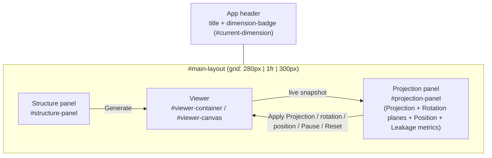

# UI Controls Reference

This document fully specifies every interactive control in the N-D Projection
Studio frontend, what it does in isolation, and — most importantly — how it
interacts with every other control. The high-level feature list lives in the
[README](../README.md); this document is the control-by-control and
event-by-event reference for [frontend/index.html](../frontend/index.html),
[frontend/js/main.js](../frontend/js/main.js),
[frontend/js/controls.js](../frontend/js/controls.js),
[frontend/js/viewer.js](../frontend/js/viewer.js) and
[frontend/js/mathnd.js](../frontend/js/mathnd.js).

## Contents

- [Layout map](#layout-map)
- [Header](#header)
- [Structure panel](#structure-panel)
- [Viewer](#viewer)
- [Projection panel](#projection-panel)
- [Rotation planes](#rotation-planes)
- [Position](#position)
- [Leakage metrics](#leakage-metrics)
- [Cross-control interrelationships (read this)](#cross-control-interrelationships-read-this)
- [Full control reference table](#full-control-reference-table)

## Layout map

The page is a single 3-column CSS grid (`#main-layout`) under a header bar.
Nothing lives outside these four regions.

Note that **"Projection"**, **"Rotation planes"**, **"Position"**, and
**"Leakage metrics"** are four visually separate `<h2>` sections but are
all one `<aside>` / one JS module scope (`main.js`) — they share state
(`currentDimension`, `viewer`) freely, which is why the interrelationships
below cross section boundaries so often.

## Header

| Control | Element | Behavior |
|---|---|---|
| Title | `<h1>` | Static text. |
| Dimension badge | `#dimension-badge` / `#current-dimension` | Read-only. Set exactly once per successful **Generate**, from the server's `GenerateResponse.dimension` (the actual column count of the returned point array — the authoritative value, not just an echo of whatever the Structure panel's `dimension` field said). Nothing else in the UI writes to it, and it does not update live during rotation/projection. |

`currentDimension` (the JS variable behind the badge) is the single source
of truth used to clamp the Rotation planes' axis choices and the
Projection panel's axis-type fields (see
[Cross-control interrelationships](#cross-control-interrelationships-read-this)).

## Structure panel

`#structure-panel`. Responsible for generating the N-D point set.

### Type select — `#structure-type-select`

- Populated at startup from `GET /api/structures`, one `<option>` per key in
  the registry ([ndstudio/structures/registry.py](../ndstudio/structures/registry.py)),
  in server-declared order (`hypersphere` is first and is the default
  selection on page load).
- `change` → `rebuildStructureForm()`: throws away and rebuilds every field
  in `#structure-params` from that structure's schema. **This does not
  regenerate anything by itself** — you must also click **Generate**.

### Structure parameters — `#structure-params` (dynamic)

Built by the shared schema-driven form builder
(`buildForm` in [controls.js](../frontend/js/controls.js)). Every structure
type — including its own `dimension` field — is described by a small JSON
schema; the builder maps each declared `type` to one HTML control:

| Schema `type` | Rendered control | Value coercion when read (`readForm`) |
|---|---|---|
| `int` | `<input type="number" step="1">` with `min`/`max` attributes | `parseInt(value, 10)` |
| `float` | `<input type="number" step="0.1">` with `min`/`max` attributes | `parseFloat(value)` |
| `bool` | `<input type="checkbox">` | `input.checked` |
| `choice` | `<select>` from `options[]` | numeric-looking option strings become `Number`, otherwise left as a string |
| `text` | `<textarea rows="3">` | raw string, unmodified |

`min`/`max` are only HTML attributes (they drive the spinner arrows); **they
are not enforced against manual keyboard entry**. Typing an out-of-range
value and clicking Generate sends it to the server as-is; the server
rejects it with a 422 and the message is surfaced verbatim in
`#structure-error` — there is no client-side blocking.

Per-structure schema (from
[structures/registry.py](../ndstudio/structures/registry.py)):

| Structure key | Label | `dimension` control | Other params |
|---|---|---|---|
| `hypersphere` | Hypersphere / Spherical Code | int, 4–12, default 6 | `num_points` int 4–500 (150); `radius` float 0.1–10 (1.0); `mode` choice `random`\|`spherical_code` (spherical_code); `seed` int 0–999999 (0) |
| `hypercube` | Hypercube | int, 4–12, default 5 | `edge_length` float 0.5–6 (2.0) |
| `cross_polytope` | Cross-Polytope (Orthoplex) | int, 4–12, default 6 | `radius` float 0.1–10 (1.0) |
| `root_system_d` | Root System D_n | int, 4–12, default 6 | — |
| `root_system_e` | Root System E_n | **choice** `6\|7\|8`, default 8 | — |
| `random_cloud` | Random Point Cloud | int, 4–12, default 6 | `num_points` int 4–2000 (300); `distribution` choice `gaussian`\|`uniform_ball`\|`uniform_cube` (gaussian); `scale` float 0.1–10 (1.0); `seed` int 0–999999 (0) |
| `sphere_packing` | Layered Sphere Packing | int, 4–12, default 6 | `num_shells` int 1–8 (3); `points_per_shell` int 4–200 (40); `radius_step` float 0.1–5 (1.0); `seed` int 0–999999 (0) |
| `simplex` | Regular Simplex | int, 4–12, default 6 | — |
| `voronoi_neighborhood` | Voronoi Neighborhood | int, **4–8**, default 5 | `num_points` int 10–150 (60); `center_index` int **0–149 (fixed)**, default 0; `seed` int 0–999999 (0) |

> **Known quirk:** `voronoi_neighborhood`'s `center_index` max is hardcoded
> to 149 regardless of the `num_points` you actually choose. If you set
> `num_points` below 150 and pick a `center_index` at or above it, Generate
> fails server-side with a validation error — the form gives no client-side
> warning.

`root_system_e` is the only structure whose `dimension` control is a
dropdown of exactly `{6, 7, 8}` rather than a free 4–12 spinner (E_n root
systems are only mathematically defined here for those three dimensions).

### Generate button — `#generate-btn`

The only control that actually talks to the backend for structure
generation, and the trigger for almost every other panel's refresh.
`handleGenerate()` does, in order:

1. Clear `#structure-error`.
2. Read `#structure-params` → split into `dimension` + the rest (`params`).
3. `POST /api/generate` with `{structure_type, dimension, params}`.
4. On success:
   - Update `currentDimension` and the header badge from the response's
     `dimension` (not the request's).
   - `viewer.setStructure(points, edges, labels)` — replaces the point
     cloud, **resets every rotation plane's angle to 0** (see
     [Rotation planes](#rotation-planes)), and recomputes point colors from
     `labels`.
   - Render `#structure-meta` as `points: N` plus the structure's own
     `meta` dict (see table below).
   - `rotationPanel.setDimension(currentDimension)` — silently drops any
     rotation-plane row that references an axis ≥ the new dimension, and
     repopulates every row's axis dropdowns to `0..dimension-1`.
   - `rebuildProjectionForm()` — **unconditionally resets every Projection
     panel field to its schema default** (see
     [Cross-control interrelationships](#cross-control-interrelationships-read-this)
     for why this matters).
   - `handleApplyProjection()` is called automatically, so the new
     structure is immediately visible through whatever projection method is
     currently selected.
5. On failure: the thrown error's message is written to `#structure-error`
   (nothing else changes — the viewer keeps showing the previous structure).

Meta fields shown in `#structure-meta` by structure type (from each
generator in [ndstudio/structures/](../ndstudio/structures)):

| Structure key | Meta keys |
|---|---|
| `hypersphere` | `mode`, `radius`, `num_points` |
| `hypercube` | `num_vertices` |
| `cross_polytope` | `num_vertices` |
| `root_system_d` | `family` (`"D"`), `num_roots` |
| `root_system_e` | `family` (`"E"`), `num_roots` |
| `random_cloud` | `distribution` |
| `sphere_packing` | `num_shells`, `points_per_shell`, `packing_radius` |
| `simplex` | `num_vertices` |
| `voronoi_neighborhood` | `center_index`, `num_neighbors` |

### Readouts

- `#structure-meta` — informational only, overwritten on every successful Generate.
- `#structure-error` — informational only, cleared at the start of every Generate attempt.

## Viewer

`#viewer-container` / `#viewer-canvas`. Not a form — a live Three.js
viewport. It has no buttons of its own, but it is the thing every other
control ultimately drives.

### Camera controls (mouse/touch, via `OrbitControls`)

| Input | Effect |
|---|---|
| Left-drag | Orbit the camera around the scene |
| Scroll wheel / pinch | Zoom (dolly) |
| Right-drag | Pan |
| Middle-drag | Also dollies (OrbitControls default; not mentioned in the on-screen hint) |

`#viewer-hint` is a static label reminding the user of the left three.
**These camera controls only move the Three.js camera** — they never touch
the underlying N-D coordinates and are completely independent of the
Rotation planes controls described below. "Orbiting" looks at the
structure from a different angle; "rotating" (via the Rotation planes
panel) actually spins the N-D point cloud itself before it's projected.

### Per-frame render pipeline

Every animation frame (`Viewer._loop` in [viewer.js](../frontend/js/viewer.js)):

1. Each rotation row carries its own persisted `angle` (radians) rather
   than a value derived from elapsed time. Unless **Pause** is engaged,
   every row's `angle` is incremented by `speed * dt` (`dt` = seconds
   since the previous frame, clamped to 0.25s so a backgrounded/throttled
   tab can't produce one huge jump on return). While paused, `angle` is
   left untouched.
2. *If* a structure and a projection recipe both exist:
   `rotated = applyRotations(basePoints, rotations)` — one plane rotation
   per configured row, each using its own current `angle`, composed in row
   order (see [mathnd.js](../frontend/js/mathnd.js)).
3. `moved = translate(rotated, offset)` — adds the Position panel's fixed
   N-D offset vector to every point, skipped entirely when every axis is
   still 0 (the common case). Unlike rotation, there's no animation here:
   `offset` only changes on direct user input or a reset, never with
   elapsed time.
4. `projected = applyProjection(moved, projectionRecipe)` — the fixed
   recipe returned by the last **Apply Projection** call.
5. Point positions and edge line segments are written into the Three.js
   geometry; point colors were fixed at Generate time (`label % 6` indexes
   a 6-color palette, so with more than 6 labels colors repeat).

Because `angle` is real, persisted state rather than a formula over a
shared clock, **Pause genuinely freezes the current pose and Resume
continues from it** — no jump, no reset. Editing one row's `plane`/`speed`
while others keep animating doesn't disturb any row's `angle`, since rows
are matched across edits by an internal id in `Viewer.setRotations`.

This client-side re-application (rotate → project, every frame, no network
call) is what keeps rotation smooth; the formulas in `mathnd.js` are
unit-tested to numerically match the Python reference in
[ndstudio/projections/methods.py](../ndstudio/projections/methods.py).

## Projection panel

Top part of `#projection-panel`. Turns the current N-D points into the 3D
coordinates the viewer actually draws.

### Method select — `#projection-method-select`

- Populated at startup from `GET /api/projections`
  ([projections/registry.py](../ndstudio/projections/registry.py));
  `orthogonal` is first and is the default.
- `change` → `rebuildProjectionForm()`: rebuilds `#projection-params` for
  the newly selected method, clamping the HTML `max` attribute of any
  `axis_x`/`axis_y`/`axis_z`/`pole_axis` field to `currentDimension - 1`.
  **Does not re-apply the projection** — click **Apply Projection**
  afterward to see the effect (the one exception is immediately after a
  Generate, which auto-applies — see below).

### Projection parameters — `#projection-params` (dynamic)

Same schema-driven builder as the structure form. Per-method schema (from
[projections/registry.py](../ndstudio/projections/registry.py)):

| Method key | Label | Params |
|---|---|---|
| `orthogonal` | Orthogonal (axis-aligned) | `axis_x` int (0), `axis_y` int (1), `axis_z` int (2) — each clamped client-side to `0..dimension-1` |
| `pca` | PCA (top 3 principal components) | none — requires an existing point set (uses the viewer's current base points) |
| `jl` | Random Johnson–Lindenstrauss | `seed` int 0–9999 (0); `orthonormalize` bool (true) |
| `custom` | User-Defined Matrix | `matrix_json` textarea — must parse to a JSON array of shape exactly `3 × dimension` |
| `perspective` | Perspective from N-space | `camera_distance` float 1.5–20 (4.0) |
| `stereographic` | Stereographic | `pole_axis` int **-1**..`dimension-1` (default **-1**, a sentinel meaning "last axis" — this meaning is not explained anywhere in the UI itself); `radius` float 0.1–10 (1.0) |

For `custom`, `rebuildProjectionForm()` fills `matrix_json` with a default
identity-slice matrix (rows selecting axes 0, 1, 2) sized to the current
dimension, but **only if the field is currently empty** — see the
persistence note below.

### Apply Projection button — `#apply-projection-btn`

`handleApplyProjection()`:

1. Clear `#projection-error`.
2. Read `#projection-params`.
3. `POST /api/project` with `{method, dimension: currentDimension, points: viewer.basePoints, params}`.
   **`viewer.basePoints` is the un-rotated point set from the last
   Generate** — rotation-plane state is never sent here.
4. On success, hand the returned recipe (`{kind: "matrix"|"perspective"|"stereographic", ...}`)
   to `viewer.setProjectionRecipe(recipe)`. The recipe is a *fixed*
   description (a static 3×n matrix + mean, or a couple of scalars) — it is
   **not recomputed per frame**. Concretely: PCA/JL/orthogonal/custom
   compute their matrix once, from the un-rotated base cloud, at the moment
   you click Apply Projection; the render loop then rotates the live points
   first and applies that fixed matrix afterward every frame. Rotating the
   structure therefore spins it relative to axes that were fixed at Apply
   time — it does not make PCA "track" the rotation.
5. On failure, the error message goes to `#projection-error` and the
   viewer keeps the previous recipe.

### Auto-apply on Generate

`handleGenerate()` always finishes by calling `handleApplyProjection()`
using whatever method/params are selected *after* `rebuildProjectionForm()`
has already reset them to defaults. So a fresh structure is always visible
immediately, using the currently-selected method's **default** parameters
(custom matrix JSON excepted, since it persists — see below).

### Readout

- `#projection-error` — cleared at the start of every Apply Projection attempt.

## Rotation planes

Middle part of `#projection-panel` (`#rotation-controls`,
`#add-rotation-btn`, `#pause-btn`, `#reset-rotation-btn`). Purely a
client-side visual transform — **rotation state is never sent to the
backend as parameters**; the only place rotated coordinates ever leave the
browser is as raw numbers in the Analyze Leakage request (see below).

### Rows — `#rotation-controls` (dynamic, via `RotationPanel`)

Each row is `{id, plane: [i, j], speed, angleDeg}` rendered as two lines:

- Two axis `<select>` dropdowns (`0..dimension-1`), independently choosable
  for `i` and `j`.
- A speed `<input type="range">` **and** a paired `<input type="number">`,
  both range **-2..2**, step 0.05, default **0.5** — radians/second added
  to that row's own persisted angle every frame while playing, so negative
  values reverse direction and 0 genuinely freezes that row at whatever
  angle it currently shows (not just at 0). Dragging the slider updates the
  number box live; typing in the number box updates the slider, clamped to
  -2..2 on blur (so you can type values while the slider temporarily shows
  its clamped equivalent).
- A `✕` remove button.
- A second, smaller line: an **Angle** `<input type="number">` in
  **degrees**, only enabled while rotation is paused (`RotationPanel.paused`).
  On `input`/`blur` it converts to radians and calls
  `viewer.setRotationAngle(id, radians)` directly — a one-shot override of
  that row's live `angle`, bypassing `Viewer.setRotations`'s
  angle-preserving merge entirely. It's write-only (no live readout while
  playing): `angleDeg` is UI-only state on the row object, redrawn from
  whatever was last typed, not polled back from `Viewer`.

The `id` is assigned once per row (in `RotationPanel.addRow`) and is what
lets `Viewer.setRotations` preserve that row's live `angle` across edits to
other fields — see [Per-frame render pipeline](#viewer).

Any row change to plane/speed calls `rotationPanel.getRotations()` →
`viewer.setRotations(rotations)` immediately (no Apply step needed for
rotation, unlike structures/projections). The Angle field is a deliberate
exception — it calls `viewer.setRotationAngle` directly instead, since
`setRotations`'s merge logic always preserves the previous live angle and
would otherwise silently discard a typed value.

> **Known quirk — same axis twice:** nothing prevents selecting the same
> axis for both dropdowns in a row. `rotatePlane(points, i, j, theta)` in
> [mathnd.js](../frontend/js/mathnd.js) writes `copy[i]` then `copy[j]`; if
> `i === j` the second write clobbers the first, and the net effect on that
> one coordinate is `x * (sin θ + cos θ)` — a pulsing **scale**, not a
> rotation. This is a real, reproducible visual artifact, not a hypothetical.

### Add rotation plane — `#add-rotation-btn`

- Capped at **one row per current dimension** (`RotationPanel._maxRows`);
  clicks beyond that silently no-op. A 4-D structure still caps at 4 rows
  (unchanged); a 12-D one now allows up to 12.
- Every new row defaults to speed 0.5 and the **first pair of axes no
  existing row is already using** (`RotationPanel._nextUnusedPlane`), so
  stacking rows starts out fully independent of one another. Only once
  every axis is already claimed by some row does a new row fall back to
  reusing axes **(0, min(3, dimension-1))**, which may end up duplicating
  an existing row.

### Play/Pause button — `#pause-btn` (default label: "⏸ Pause")

- `click` toggles a `rotationsPaused` flag in [main.js](../frontend/js/main.js)
  and calls `viewer.setAnimating(!rotationsPaused)`; the button's label and
  `aria-pressed` attribute flip between `"⏸ Pause"` / `aria-pressed="false"`
  (playing) and `"▶ Resume"` / `aria-pressed="true"` (paused).
- While paused, `Viewer._loop` stops incrementing every row's `angle` but
  keeps rendering, so the structure holds exactly its current pose (camera
  orbiting via OrbitControls still works normally). Clicking **Resume**
  continues incrementing from that same angle — no jump, no reset.
- Also calls `rotationPanel.setPaused(rotationsPaused)`, which enables or
  disables every row's Angle input to match — typing an exact angle only
  makes sense while the animation loop isn't about to overwrite it.

### Reset rotation button — `#reset-rotation-btn`

- `click` calls `viewer.resetRotations()`, setting every row's `angle`
  back to `0` — the same zero-angle base orientation the structure has
  right after Generate — regardless of whether Pause is currently engaged.
- Also calls `rotationPanel.resetAngleDisplays()`, zeroing every row's
  Angle input so it doesn't keep showing a stale typed value once the real
  angle has been reset out from under it.
- Generate calls the same reset internally (via `viewer.setStructure`), so
  a brand-new structure always starts unrotated.

> **Don't confuse the two.** Pause preserves the current pose (Resume
> continues it); Reset rotation discards it back to angle 0. They're
> deliberately separate buttons — see also the cross-control note below.

### Dimension coupling

`rotationPanel.setDimension(dimension)` is called only from
`handleGenerate()`. It:

- Drops any row whose `plane[0]` or `plane[1]` is ≥ the new dimension,
  with no warning.
- Repopulates every remaining row's two axis dropdowns to `0..dimension-1`.
- Zeroes every surviving row's `angleDeg` display, matching the real
  `angle` also being reset to 0 by Generate's call to
  `viewer.setStructure` → `resetRotations`.

Switching the Structure Type select or editing structure params does
**not** call this — only a completed Generate does, since only the server
response carries the authoritative new dimension.

## Position

Between Rotation planes and Leakage metrics in `#projection-panel`
(`#position-controls`, `#reset-position-btn`). Shifts the N-D structure by
a fixed vector, applied every frame after rotation and before projection
(see [Per-frame render pipeline](#viewer)) — moving the object, rather
than spinning it in place. Like Rotation planes, this is purely client-side
and never reaches the server as parameters; only the resulting coordinates
do, via Analyze Leakage.

### Rows — `#position-controls` (dynamic, via `PositionPanel`)

Unlike `RotationPanel`, there are no add/remove buttons — the panel always
renders exactly one row per axis (`0..dimension-1`), since a translation
offset is a single dense N-D vector, not a sparse list of independent
planes. Each row is:

- A read-only axis label.
- A paired `<input type="range">` and `<input type="number">`, both range
  **-5..5**, step 0.05, default **0**. Dragging the slider updates the
  number box live; typing in the number box updates the slider, clamped to
  -5..5 on blur. There is no persisted "angle"/animation state to preserve
  here — the value typed *is* the current offset, immediately.
- `#position-controls` itself scrolls independently (`max-height: 220px`)
  once the row count exceeds a handful, so a 12-D structure's 12 sliders
  don't push the rest of the panel out of view.

Any row change calls `positionPanel.getOffset()` →
`viewer.setOffset(offset)` immediately (no Apply step needed, same as
Rotation planes).

### Reset position — `#reset-position-btn`

`positionPanel.reset()` zeroes every axis, re-renders all sliders back to
0, and re-emits to `viewer.setOffset`. This is the only way to zero the
offset without a full Generate — see Dimension coupling below.

### Dimension coupling

`positionPanel.setDimension(dimension)` is called both at startup and from
`handleGenerate()`, right alongside `rotationPanel.setDimension`. It always
**rebuilds the offset as a fresh all-zero vector** of the new length and
re-renders — so, unlike rotation angles (which persist in `Viewer` across
a Generate until a rotation-panel row is actually removed), **the position
offset always resets to 0 on every Generate**, whether or not the
dimension actually changed.

### Interaction with Leakage metrics and non-linear projections

The offset is included in whatever `Viewer._lastTransformed` holds, so
Analyze Leakage sees it exactly like a live rotation. For the four
matrix-based projection methods (Orthogonal, PCA, JL, User-Defined
Matrix), a uniform N-D translation produces a uniform 3D shift and every
Leakage metric is unchanged, since all five are built from relative
distances or a self-computed centroid. **Perspective** and **Stereographic**
are the exception: both divide by a term derived from a point's absolute
coordinate (`camera_distance - w`, `radius - w`), so moving the structure
relative to the origin can genuinely change how distorted it looks under
those two methods specifically.

## Leakage metrics

Bottom part of `#projection-panel` (`#analyze-btn`, `#metrics-readout`).

### Analyze Leakage button — `#analyze-btn`

`handleAnalyze()`:

1. Clear `#metrics-readout`.
2. `viewer.getSnapshotForMetrics()` returns `{pointsNd, points3d}` = the
   **rotated and translated** N-D points and their projected 3D
   counterparts from the *most recently rendered animation frame* — not a
   fresh recompute, and not necessarily the un-rotated, un-translated base
   points.
3. If either array is empty (no structure generated, or no projection
   applied yet), throws a "Generate a structure and apply a projection
   first" error into `#metrics-readout`.
4. Otherwise `POST /api/metrics` with `{points_nd, points_3d, options: {}}`
   (always empty options — see below) and renders the result.

> **Non-reproducible while animating.** If rotation is playing and any row
> has nonzero speed, each Analyze click captures whatever rotation angle
> happened to be rendered at that instant, so results will differ between
> clicks. Click **Pause** first for a reproducible reading — it freezes
> every row's current angle without touching its `speed`, so **Resume**
> restores the same motion afterward. (Setting a row's speed to 0 also
> freezes it in place now, but you'd have to remember its old value to
> restore the motion yourself.)

### Metrics readout — `#metrics-readout`

Renders five metric groups plus an optional sampling note, from
[ndstudio/metrics/leakage.py](../ndstudio/metrics/leakage.py). Only a
subset of each group's fields is actually displayed; the rest is present in
the raw API response but not shown in the panel:

| Group | Shown in UI | Returned but **not** shown |
|---|---|---|
| `containment` | `leaked_out_fraction`/`count`, `leaked_in_fraction`/`count` | `percentile`, `threshold_nd`, `threshold_3d` |
| `neighborhood_inversion` | `inversion_rate`, `k`, `hard_inversion_count`, `hard_inversion_fraction` | `mean_jaccard_overlap` (implied by `inversion_rate = 1 - mean_jaccard_overlap`) |
| `projected_overlap` | `overlap_fraction`, `packing_radius`, `scale_factor` | `sampled_pairs`, `non_overlapping_pairs_nd`, `newly_overlapping_pairs_3d` |
| `rank_distortion` | `spearman_r`, `discordant_fraction` | `kendall_tau`, `sampled_pairs` |
| `adjacency_preservation` | `edge_jaccard`, `k`, `components_nd`, `components_3d` | — (all shown) |
| `sample_info` | Rendered as a note **only when** `sampled` is true: `sample_size` of `original_count` | `sampled` itself (used as the condition) |

The hidden fields are visible via the browser network inspector on the
`/api/metrics` response if needed for debugging.

### No UI for metrics options

`compute_leakage_metrics` accepts an `options` dict
(`max_points` subsample cap, default 400; `seed`, default 0;
`containment_percentile`, default 50.0; `k_neighbors`, default 10;
`packing_radius`, auto-computed from nearest-neighbor spacing when
omitted) — but the frontend always sends `{}`, so **every Analyze run uses
server defaults**. There is currently no control anywhere in the UI to
change these.

## Cross-control interrelationships (read this)

The individual sections above call these out inline; they're collected
here because they're easy to miss and explain most "why did the UI just do
that?" questions.

1. **Generate always resets the Projection panel's fields to their schema
   defaults — even if you don't change the method.** `rebuildProjectionForm()`
   is called unconditionally at the end of every `handleGenerate()`. If you
   set `camera_distance` to 10 for Perspective, then click Generate again
   (e.g. just to get a new random seed), `camera_distance` silently goes
   back to 4.0. **Exception:** the `custom` method's `matrix_json` textarea
   is only refilled when it is empty, so hand-edited matrices survive
   repeated Generate clicks (they may end up the wrong shape for a new
   dimension, in which case the next Apply Projection fails with a clear
   shape-mismatch error).
2. **Structure parameters, by contrast, are not reset by Generate.**
   `handleGenerate()` never calls `rebuildStructureForm()`; your typed
   values stay in the fields across repeated Generate clicks. They're only
   discarded if you switch the Structure Type select (which necessarily
   rebuilds the whole params list for the new type).
3. **Apply Projection always uses the un-rotated base points**, regardless
   of the current rotation angle or whether it's playing or paused.
   Rotation is applied *after* the fixed projection recipe's basis is
   chosen, every frame, in the render loop — so PCA/JL bases do not "chase"
   the rotating structure.
4. **Analyze Leakage uses whatever the render loop last drew** (rotated,
   if animating), not the base points. This is the opposite input to what
   Apply Projection uses, and is the main source of non-reproducible
   metrics runs.
5. **Rotation-plane settings never reach the backend as parameters** — they
   only affect what's rendered client-side, and indirectly, the raw
   coordinate arrays sent by Analyze Leakage. The backend has no concept
   of "rotation planes."
6. **The dimension badge, rotation-plane axis ranges, and projection
   axis-field clamps all update only after a successful Generate**, from
   the server's returned dimension — not from merely typing a new
   `dimension` value into the Structure panel before clicking Generate.
7. **Pause freezes the current pose; Reset rotation discards it back to
   angle 0.** Two separate buttons on purpose; see
   [Rotation planes](#rotation-planes).
8. Selecting the **same axis twice** in a rotation row silently produces a
   scale-pulse artifact instead of a rotation; see
   [Rotation planes](#rotation-planes).
9. `voronoi_neighborhood`'s `center_index` range (0–149) is fixed and not
   narrowed to the currently chosen `num_points`; picking an index beyond
   your point count only fails once you click Generate.
10. Numeric field `min`/`max` are spinner hints only — manual keyboard
    entry outside that range is not blocked client-side; it surfaces as a
    server-side validation error in the panel's error readout.
11. **Position resets to 0 on every Generate, unconditionally** — same
    "authoritative dimension drives a fresh sub-state" pattern as item 6,
    but stronger: rotation angles persist until a row is removed, while
    the position offset is rebuilt from scratch every time
    `positionPanel.setDimension` runs, which is every Generate. Use
    **Reset position** to zero it out manually without a full Generate;
    see [Position](#position).

## Full control reference table

| Element id | Type | Location | Fires on | Handler | Primary effect |
|---|---|---|---|---|---|
| `structure-type-select` | `<select>` | Structure panel | `change` | `rebuildStructureForm` | Rebuilds `#structure-params` |
| `field-*` (structure) | dynamic | `#structure-params` | n/a | read by `handleGenerate` | Request body for `/api/generate` |
| `generate-btn` | `<button>` | Structure panel | `click` | `handleGenerate` | Full refresh: viewer, meta, rotation dims, projection form + auto-apply |
| `structure-meta` | readout | Structure panel | n/a | `renderMeta` | Shows point count + structure meta |
| `structure-error` | readout | Structure panel | n/a | n/a | Shows Generate failures |
| `viewer-canvas` | `<canvas>` | Viewer | mouse/touch | `OrbitControls` | Orbits/zooms/pans the camera only |
| `viewer-hint` | static text | Viewer | n/a | n/a | Reminder of mouse bindings |
| `projection-method-select` | `<select>` | Projection panel | `change` | `rebuildProjectionForm` | Rebuilds `#projection-params` |
| `field-*` (projection) | dynamic | `#projection-params` | n/a | read by `handleApplyProjection` | Request body for `/api/project` |
| `apply-projection-btn` | `<button>` | Projection panel | `click` | `handleApplyProjection` | Fetches recipe, calls `viewer.setProjectionRecipe` |
| `projection-error` | readout | Projection panel | n/a | n/a | Shows Apply Projection failures |
| `rotation-controls` | dynamic rows | Rotation planes | row edits | `RotationPanel._emit` | `viewer.setRotations` (immediate, no Apply step) |
| `add-rotation-btn` | `<button>` | Rotation planes | `click` | `RotationPanel.addRow` | Adds a row defaulting to the next unused axis pair, capped at one row per dimension |
| `pause-btn` | `<button>` | Rotation planes | `click` | `setPaused` (main.js) | `viewer.setAnimating`; toggles Pause/Resume label + `aria-pressed`; freezes/resumes every row's angle in place; enables/disables every row's Angle input |
| `reset-rotation-btn` | `<button>` | Rotation planes | `click` | inline listener | `viewer.resetRotations`; snaps every row's angle back to 0; also zeroes every row's Angle input display |
| (per-row) Angle input | dynamic | Rotation planes | `input`/`blur` | inline listener (`RotationPanel._render`) | `viewer.setRotationAngle(id, radians)`; degrees, enabled only while paused |
| `position-controls` | dynamic rows | Position | row edits | `PositionPanel._emit` | `viewer.setOffset` (immediate, no Apply step) |
| `reset-position-btn` | `<button>` | Position | `click` | inline listener | `positionPanel.reset()`; re-renders sliders to 0 and calls `viewer.setOffset` |
| `analyze-btn` | `<button>` | Leakage metrics | `click` | `handleAnalyze` | Fetches metrics from the live render snapshot |
| `metrics-readout` | readout | Leakage metrics | n/a | `renderMetrics` | Shows 5 metric groups + sampling note |
| `current-dimension` | readout | Header | n/a | `handleGenerate` | Authoritative dimension, post-Generate only |
