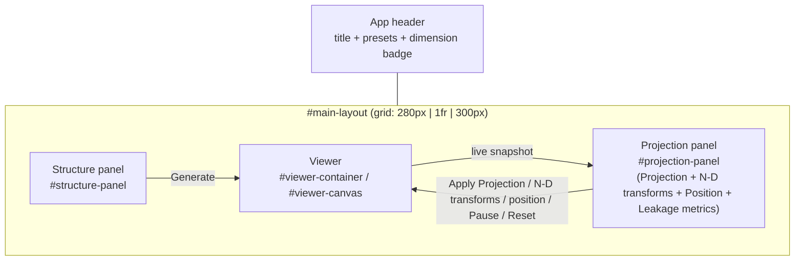

# UI Controls Reference

This document fully specifies every interactive control in the N-D Projection
Studio frontend, what it does in isolation, and — most importantly — how it
interacts with every other control. The high-level feature list lives in the
[README](../README.md); this document is the control-by-control and
event-by-event reference for [frontend/index.html](../frontend/index.html),
[frontend/js/main.js](../frontend/js/main.js),
[frontend/js/controls.js](../frontend/js/controls.js),
[frontend/js/viewer.js](../frontend/js/viewer.js) and
[frontend/js/mathnd.js](../frontend/js/mathnd.js), plus the versioned storage
format in [frontend/js/presets.js](../frontend/js/presets.js).

## Contents

- [Layout map](#layout-map)
- [Header](#header)
- [Presets](#presets)
- [Structure panel](#structure-panel)
- [Viewer](#viewer)
- [Projection panel](#projection-panel)
- [N-D transforms](#n-d-transforms)
- [Position](#position)
- [Leakage metrics](#leakage-metrics)
- [Cross-control interrelationships (read this)](#cross-control-interrelationships-read-this)
- [Full control reference table](#full-control-reference-table)

## Layout map

The page is a single 3-column CSS grid (`#main-layout`) under a header bar.
Nothing lives outside these four regions.



Note that **"Projection"**, **"N-D transforms"**, **"Position"**, and
**"Leakage metrics"** are four visually separate `<h2>` sections but are
all one `<aside>` / one JS module scope (`main.js`) — they share state
(`currentDimension`, `viewer`) freely, which is why the interrelationships
below cross section boundaries so often.

## Header

| Control | Element | Behavior |
|---|---|---|
| Title | `<h1>` | Static text. |
| Named preset | `#preset-select` | Selects and immediately loads a browser-local named preset; `Current session` detaches the working state from any name without changing the scene. |
| Save / Save as | `#preset-save-btn` / `#preset-save-as-btn` | Updates the selected preset or opens the naming dialog to create a separate one. |
| More actions | `#preset-menu` | Rename, Duplicate, Delete, Export selected, Export all, and Import. |
| Dimension badge | `#dimension-badge` / `#current-dimension` | Read-only. Set exactly once per successful **Generate**, from the server's `GenerateResponse.dimension` (the actual column count of the returned point array — the authoritative value, not just an echo of whatever the Structure panel's `dimension` field said). Nothing else in the UI writes to it, and it does not update during transforms or projection changes. |

`currentDimension` (the JS variable behind the badge) is the single source
of truth used to clamp the N-D transform targets and the
Projection panel's axis-type fields (see
[Cross-control interrelationships](#cross-control-interrelationships-read-this)).

## Presets

The centered header toolbar manages complete named configurations entirely in
the browser. Named presets are stored as one versioned JSON bundle under:

```text
nd-projection-studio.presets.v1
```

The automatically restored working state uses a separate key:

```text
nd-projection-studio.session.v1
```

Both are `localStorage` entries scoped to the exact browser origin and profile.
They are not files in the project directory, and `127.0.0.1:8000` does not share
them with `localhost:8000`.

### Saved configuration

`captureConfiguration()` records:

- Structure type and every current Structure field, including random seeds.
- Projection method and every current Projection field, including a custom
  matrix.
- Transform rows in order: type, canonical target, Speed, and the Viewer's exact
  live Angle/Phase at capture time.
- The complete Position vector.
- Orbit camera position and target.
- The current play/pause flag. A load nevertheless opens paused intentionally,
  preserving the saved pose until the user chooses Resume.

Generated point arrays, projection recipes, metrics, and rendered geometry are
not stored. Loading regenerates them from the parameters and seeds.

### Select, Save, and Save as

- `#preset-select` contains `Current session` plus every named preset. Selecting
  a name loads it immediately. Selecting `Current session` only clears the
  active name; it does not reset or replace the current scene.
- `#preset-save-btn` updates the selected preset's configuration and `modified`
  timestamp. With `Current session` selected it behaves like Save as.
- `#preset-save-as-btn` opens `#preset-name-dialog`, defaulting to `Untitled
  preset` or a unique copy name. Names are required, limited to 80 characters,
  and compared case-insensitively. Replacing an existing name requires
  confirmation.
- A `•` appended to the selected option means the current configuration differs
  from its named save. Play/pause alone is ignored for this comparison because
  every load deliberately pauses.

Preset loading is atomic with respect to expected failures: the app validates
the schema, requests both the generated structure and projection recipe, and
only then replaces the controls and visible scene. A validation, generation, or
projection error therefore leaves the previous scene intact. Successful loads
restore the ordered transforms, exact phases, Position, and camera view, clear
old metrics, and display the scene paused.

### More menu, import, and export

`#preset-menu` provides:

- **Rename** — changes only the label and modified timestamp; duplicate names
  are rejected.
- **Duplicate** — creates a new stable ID and timestamps with a suggested unique
  `copy` name.
- **Delete** — confirms first, removes the named record, and leaves the current
  scene as an unnamed Current session.
- **Export selected…** — downloads one indented, human-readable
  `<slug>.ndstudio.json` document.
- **Export all…** — downloads `ndstudio-presets.ndstudio.json`, containing the
  complete versioned collection.
- **Import…** — accepts either exported form up to 1 MB, validates every
  configuration against the current Structure and Projection registries, and
  offers Replace, Keep both, or Cancel import for each name conflict. Keep both
  assigns a unique name and new ID.

The session snapshot is written at most once per second during valid control,
animation-phase, Position, or camera changes, and once more during normal page
unload. Incomplete transient form edits are skipped, leaving the last valid
session intact. On startup the app attempts to regenerate that session; if it is
invalid or no longer compatible, startup falls back to the normal defaults.
Autosave never modifies a named preset—only an explicit Save does that.

## Structure panel

`#structure-panel`. Responsible for generating the N-D point set.

### Type select — `#structure-type-select`

- Populated at startup from `GET /api/structures`, one `<option>` per key in
  the registry ([ndstudio/structures/registry.py](../ndstudio/structures/registry.py)),
  in server-declared order (`hypersphere` is first and is the default
  selection on page load).
- `change` → `rebuildStructureForm()`: throws away and rebuilds every field
  in `#structure-params` from that structure's schema. **This does not
  regenerate anything by itself** — you must also click **Generate**.

### Structure parameters — `#structure-params` (dynamic)

Built by the shared schema-driven form builder
(`buildForm` in [controls.js](../frontend/js/controls.js)). Every structure
type — including its own `dimension` field — is described by a small JSON
schema; the builder maps each declared `type` to one HTML control:

| Schema `type` | Rendered control | Value coercion when read (`readForm`) |
|---|---|---|
| `int` | `<input type="number" step="1">` with `min`/`max` attributes | `parseInt(value, 10)` |
| `float` | `<input type="number" step="0.1">` with `min`/`max` attributes | `parseFloat(value)` |
| `bool` | `<input type="checkbox">` | `input.checked` |
| `choice` | `<select>` from `options[]` | numeric-looking option strings become `Number`, otherwise left as a string |
| `text` | `<textarea rows="3">` | raw string, unmodified |

`min`/`max` are only HTML attributes (they drive the spinner arrows); **they
are not enforced against manual keyboard entry**. Typing an out-of-range
value and clicking Generate sends it to the server as-is; the server
rejects it with a 422 and the message is surfaced verbatim in
`#structure-error` — there is no client-side blocking.

Per-structure schema (from
[structures/registry.py](../ndstudio/structures/registry.py)):

| Structure key | Label | `dimension` control | Other params |
|---|---|---|---|
| `hypersphere` | Hypersphere / Spherical Code | int, 4–12, default 6 | `num_points` int 4–500 (150); `radius` float 0.1–10 (1.0); `mode` choice `random`\|`spherical_code` (spherical_code); `seed` int 0–999999 (0) |
| `hypercube` | Hypercube | int, 4–12, default 5 | `edge_length` float 0.5–6 (2.0) |
| `cross_polytope` | Cross-Polytope (Orthoplex) | int, 4–12, default 6 | `radius` float 0.1–10 (1.0) |
| `root_system_d` | Root System D_n | int, 4–12, default 6 | — |
| `root_system_e` | Root System E_n | **choice** `6\|7\|8`, default 8 | — |
| `random_cloud` | Random Point Cloud | int, 4–12, default 6 | `num_points` int 4–2000 (300); `distribution` choice `gaussian`\|`uniform_ball`\|`uniform_cube` (gaussian); `scale` float 0.1–10 (1.0); `seed` int 0–999999 (0) |
| `sphere_packing` | Layered Sphere Packing | int, 4–12, default 6 | `num_shells` int 1–8 (3); `points_per_shell` int 4–200 (40); `radius_step` float 0.1–5 (1.0); `seed` int 0–999999 (0) |
| `simplex` | Regular Simplex | int, 4–12, default 6 | — |
| `voronoi_neighborhood` | Voronoi Neighborhood | int, **4–8**, default 5 | `num_points` int 10–150 (60); `center_index` int **0–149 (fixed)**, default 0; `seed` int 0–999999 (0) |
| `clifford_torus` | Clifford Torus | **choice** `4`, default 4 | `resolution_u` int 4–40 (24); `resolution_v` int 4–40 (24); `radius` float 0.1–10 (1.0) |
| `klein_bottle` | Klein Bottle | **choice** `4`, default 4 | `resolution_u` int 4–40 (24); `resolution_v` int 4–40 (24); `scale` float 0.1–5 (1.0) |

> **Known quirk:** `voronoi_neighborhood`'s `center_index` max is hardcoded
> to 149 regardless of the `num_points` you actually choose. If you set
> `num_points` below 150 and pick a `center_index` at or above it, Generate
> fails server-side with a validation error — the form gives no client-side
> warning.

`root_system_e` uses a dimension dropdown of `{6, 7, 8}`. Clifford Torus
and Klein Bottle use a fixed dropdown containing only `4`, because these
generators are specifically embedded in ambient 4-D. Other structures use
numeric dimension fields over their documented ranges.

### Generate button — `#generate-btn`

The only control that actually talks to the backend for structure
generation, and the trigger for almost every other panel's refresh.
`handleGenerate()` does, in order:

1. Clear `#structure-error`.
2. Read `#structure-params` → split into `dimension` + the rest (`params`).
3. `POST /api/generate` with `{structure_type, dimension, params}`.
4. On success:
   - Update `currentDimension` and the header badge from the response's
     `dimension` (not the request's).
   - `viewer.setStructure(points, edges, labels)` — replaces the point
     cloud and **resets every transform angle/phase to 0** (Axis scales
     therefore return to factor 1; see
     [N-D transforms](#n-d-transforms)), and recomputes point colors from
     `labels`.
   - Render `#structure-meta` as `points: N` plus the structure's own
     `meta` dict (see table below).
   - `rotationPanel.setDimension(currentDimension)` — silently drops any
     transform row that references an axis ≥ the new dimension, and
     repopulates every row's available target choices.
   - `rebuildProjectionForm()` — **unconditionally resets every Projection
     panel field to its schema default** (see
     [Cross-control interrelationships](#cross-control-interrelationships-read-this)
     for why this matters).
   - `handleApplyProjection()` is called automatically, so the new
     structure is immediately visible through whatever projection method is
     currently selected.
5. On failure: the thrown error's message is written to `#structure-error`
   (nothing else changes — the viewer keeps showing the previous structure).

Meta fields shown in `#structure-meta` by structure type (from each
generator in [ndstudio/structures/](../ndstudio/structures)):

| Structure key | Meta keys |
|---|---|
| `hypersphere` | `mode`, `radius`, `num_points` |
| `hypercube` | `num_vertices` |
| `cross_polytope` | `num_vertices` |
| `root_system_d` | `family` (`"D"`), `num_roots` |
| `root_system_e` | `family` (`"E"`), `num_roots` |
| `random_cloud` | `distribution` |
| `sphere_packing` | `num_shells`, `points_per_shell`, `packing_radius` |
| `simplex` | `num_vertices` |
| `voronoi_neighborhood` | `center_index`, `num_neighbors` |
| `clifford_torus` | `resolution_u`, `resolution_v`, `radius`, `num_points` |
| `klein_bottle` | `resolution_u`, `resolution_v`, `scale`, `num_points`, `closed`, `twisted_seam` |

### Readouts

- `#structure-meta` — informational only, overwritten on every successful Generate.
- `#structure-error` — informational only, cleared at the start of every Generate attempt.

## Viewer

`#viewer-container` / `#viewer-canvas`. Not a form — a live Three.js
viewport. It has no buttons of its own, but it is the thing every other
control ultimately drives.

### Camera controls (mouse/touch, via `OrbitControls`)

| Input | Effect |
|---|---|
| Left-drag | Orbit the camera around the scene |
| Scroll wheel / pinch | Zoom (dolly) |
| Right-drag | Pan |
| Middle-drag | Also dollies (OrbitControls default; not mentioned in the on-screen hint) |

`#viewer-hint` is a static label reminding the user of the left three.
**These camera controls only move the Three.js camera** — they never touch
the underlying N-D coordinates and are completely independent of the
N-D transform controls described below. "Orbiting" looks at the
structure from a different angle; "rotating" (via N-D transforms
panel) actually spins the N-D point cloud itself before it's projected.

### Per-frame render pipeline

Every animation frame (`Viewer._loop` in [viewer.js](../frontend/js/viewer.js)):

1. Each transform row carries its own persisted `angle`/phase (radians) rather
   than a value derived from elapsed time. Unless **Pause** is engaged,
   every row's `angle` is incremented by `speed * dt` (`dt` = seconds
   since the previous frame, clamped to 0.25s so a backgrounded/throttled
   tab can't produce one huge jump on return). While paused, `angle` is
   left untouched.
2. *If* a structure and a projection recipe both exist:
   `rotated = applyRotations(basePoints, rotations)` applies every row in
   order. A Plane rotation mixes its selected coordinates by the usual sine/
   cosine matrix. An Axis scale multiplies one coordinate by
   `cos(phase) + sin(phase)` (see [mathnd.js](../frontend/js/mathnd.js)).
3. `moved = translate(rotated, offset)` — adds the Position panel's fixed
   N-D offset vector to every point, skipped entirely when every axis is
   still 0 (the common case). Unlike rotation, there's no animation here:
   `offset` only changes on direct user input or a reset, never with
   elapsed time.
4. `projected = applyProjection(moved, projectionRecipe)` — the fixed
   recipe returned by the last **Apply Projection** call.
5. Point positions and edge line segments are written into the Three.js
   geometry; point colors were fixed at Generate time (`label % 6` indexes
   a 6-color palette, so with more than 6 labels colors repeat).

Because each angle/phase is persisted state rather than a formula over a
shared clock, **Pause genuinely freezes the current pose and Resume
continues from it** — no jump, no reset. Editing one row's `plane`/`speed`
while others keep animating doesn't disturb any row's `angle`, since rows
are matched across edits by an internal id in `Viewer.setRotations`.

This client-side re-application (transform → translate → project, every
frame, no network call) keeps animation smooth. Projection formulas in
`mathnd.js` mirror the Python reference implementations in
[ndstudio/projections/methods.py](../ndstudio/projections/methods.py); Axis
scale and Position are intentional client-side transforms.

## Projection panel

Top part of `#projection-panel`. Turns the current N-D points into the 3D
coordinates the viewer actually draws.

### Method select — `#projection-method-select`

- Populated at startup from `GET /api/projections`
  ([projections/registry.py](../ndstudio/projections/registry.py));
  `orthogonal` is first and is the default.
- `change` → `rebuildProjectionForm()`: rebuilds `#projection-params` for
  the newly selected method, clamping the HTML `max` attribute of any
  `axis_x`/`axis_y`/`axis_z`/`pole_axis` field to `currentDimension - 1`.
  **Does not re-apply the projection** — click **Apply Projection**
  afterward to see the effect (the one exception is immediately after a
  Generate, which auto-applies — see below).

### Projection parameters — `#projection-params` (dynamic)

Same schema-driven builder as the structure form. Per-method schema (from
[projections/registry.py](../ndstudio/projections/registry.py)):

| Method key | Label | Params |
|---|---|---|
| `orthogonal` | Orthogonal (axis-aligned) | `axis_x` int (0), `axis_y` int (1), `axis_z` int (2) — each clamped client-side to `0..dimension-1` |
| `pca` | PCA (top 3 principal components) | none — requires an existing point set (uses the viewer's current base points) |
| `jl` | Random Johnson–Lindenstrauss | `seed` int 0–9999 (0); `orthonormalize` bool (true) |
| `custom` | User-Defined Matrix | `matrix_json` textarea — must parse to a JSON array of shape exactly `3 × dimension` |
| `perspective` | Perspective from N-space | `camera_distance` float 1.5–20 (4.0) |
| `stereographic` | Stereographic | `pole_axis` int **-1**..`dimension-1` (default **-1**, a sentinel meaning "last axis," also explained by its tooltip); `radius` float 0.1–10 (1.0) |

For `custom`, `rebuildProjectionForm()` creates a fresh empty textarea and
then fills it with an identity-slice matrix (rows selecting axes 0, 1, 2)
sized to the current dimension. Switching methods or clicking Generate
rebuilds the form, so hand edits do not persist across either action.

### Apply Projection button — `#apply-projection-btn`

`handleApplyProjection()`:

1. Clear `#projection-error`.
2. Read `#projection-params`.
3. `POST /api/project` with `{method, dimension: currentDimension, points: viewer.basePoints, params}`.
   **`viewer.basePoints` is the untransformed point set from the last
   Generate** — Plane rotation, Axis scale, and Position state are not sent here.
4. On success, hand the returned recipe (`{kind: "matrix"|"perspective"|"stereographic", ...}`)
   to `viewer.setProjectionRecipe(recipe)`. The recipe is a *fixed*
   description (a static 3×n matrix + mean, or a couple of scalars) — it is
   **not recomputed per frame**. Concretely: PCA/JL/orthogonal/custom
   compute their matrix once, from the untransformed base cloud, at the moment
   you click Apply Projection; the render loop then transforms the live points
   first and applies that fixed matrix afterward every frame. Transforming the
   structure therefore changes it relative to axes that were fixed at Apply
   time — it does not make PCA "track" the live state.
5. On failure, the error message goes to `#projection-error` and the
   viewer keeps the previous recipe.

### Auto-apply on Generate

`handleGenerate()` always finishes by calling `handleApplyProjection()`
using whatever method/params are selected *after* `rebuildProjectionForm()`
has already reset them to defaults. So a fresh structure is always visible
immediately, using the currently selected method's **default** parameters.

### Readout

- `#projection-error` — cleared at the start of every Apply Projection attempt.

## N-D transforms

Middle part of `#projection-panel` (`#rotation-controls`,
`#add-rotation-btn`, `#pause-btn`, `#reset-rotation-btn`). Purely a
client-side visual transform — **transform state is never sent to the
backend as parameters**; the only place transformed coordinates ever leave the
browser is as raw numbers in the Analyze Leakage request (see below).

### Rows — `#rotation-controls` (dynamic, via `RotationPanel`)

Each row is `{id, type, plane: [i, j], speed, angleDeg}` and begins with an
explicit Transform type selector:

- **Plane rotation** when `i != j`: a genuine rotation in the selected
  coordinate plane.
- **Axis scale** when `i == j`: the selected coordinate is multiplied by
  `cos(phase) + sin(phase)`. It stretches for positive factors, collapses at
  zero, and reflects for negative factors.

The row is rendered as:

- A **Transform type** selector: `Plane rotation` or `Axis scale`.
- For Plane rotation, one selector containing canonical unordered pairs
  (`axes 0–1`, `axes 0–2`, …). Reversed pairs never appear, and planes used by
  another row are omitted. Direction is controlled by signed Angle and Speed.
- For Axis scale, one axis selector. Axes used by another scale row are omitted.
- A speed `<input type="range">` **and** a paired `<input type="number">`,
  both range **-2..2**, step 0.05, default **0.05** — radians/second added
  to that row's own persisted angle every frame while playing, so negative
  values reverse direction and 0 genuinely freezes that row at whatever
  angle it currently shows (not just at 0). Dragging the slider updates the
  number box live; typing in the number box updates the slider, clamped to
  -2..2 on blur (so you can type values while the slider temporarily shows
  its clamped equivalent). Double-clicking the slider sets Speed to 0 without
  changing the current Angle/Phase.
- A `✕` remove button.
- A second, smaller line: an **Angle** (plane rotation) or **Phase** (axis
  scale) `<input type="number">` in **degrees**, only enabled while transforms
  are paused (`RotationPanel.paused`). Axis-scale rows also show the resulting
  scale factor and whether the coordinate is scaled, collapsed, or reflected.
  A small dial mirrors the same value: while paused it can be dragged, and a
  double-click resets just that row to 0°. On numeric `input`/`change` or dial
  drag, the panel converts degrees to radians and calls
  `viewer.setRotationAngle(id, radians)` directly — a one-shot override of
  that row's live `angle`, bypassing `Viewer.setRotations`'s
  angle-preserving merge entirely. While playing, the Viewer publishes a
  lightweight phase snapshot at most 10 times per second; the panel updates
  the disabled number fields, dial positions, and axis-scale factors without
  rebuilding the controls. When Pause is clicked, the panel synchronizes once
  more before enabling manual editing, so the displayed state remains
  authoritative across the play/pause transition.

The `id` is assigned once per row (in `RotationPanel.addRow`) and is what
lets `Viewer.setRotations` preserve that row's live `angle` across edits to
other fields — see [Per-frame render pipeline](#viewer).

Any row change to type/target/speed calls `rotationPanel.getRotations()` →
`viewer.setRotations(rotations)` immediately (no Apply step needed for
transforms, unlike structures/projections). The Angle/Phase controls are a
deliberate exception — they call `viewer.setRotationAngle` directly, since
`setRotations`'s merge logic always preserves the previous live angle and
would otherwise silently discard a typed value. Changing a row's type or
target preserves that row's current Angle/Phase and Speed; it changes which
operation those values drive.

Internally, Axis scale remains encoded as `[i, i]` for the transform math.
`rotatePlane(points, i, i, phase)` in [mathnd.js](../frontend/js/mathnd.js)
yields `x_i * (sin phase + cos phase)`, but the UI no longer asks users to
discover or construct that encoding themselves.

### Add transform — `#add-rotation-btn`

- Capped at **one row per current dimension** (`RotationPanel._maxRows`);
  clicks beyond that silently no-op. A 4-D structure still caps at 4 rows
  (unchanged); a 12-D one now allows up to 12.
- Every new row defaults to Plane rotation, speed 0.05, and the first canonical
  plane no other Plane rotation row is using. Changing it to Axis scale selects the
  first axis no other scale row is using. Normal UI operations therefore cannot
  create duplicate or reversed transform targets.

### Play/Pause button — `#pause-btn` (default label: "⏸ Pause")

- `click` toggles a `rotationsPaused` flag in [main.js](../frontend/js/main.js)
  and calls `viewer.setAnimating(!rotationsPaused)`; the button's label and
  `aria-pressed` attribute flip between `"⏸ Pause"` / `aria-pressed="false"`
  (playing) and `"▶ Resume"` / `aria-pressed="true"` (paused).
- While paused, `Viewer._loop` stops incrementing every row's `angle` but
  keeps rendering, so the structure holds exactly its current pose (camera
  orbiting via OrbitControls still works normally). Clicking **Resume**
  continues incrementing from that same angle — no jump, no reset.
- Also calls `rotationPanel.setPaused(rotationsPaused, liveAngles)`, which
  synchronizes the frozen live phases and enables or disables every row's
  Angle/Phase input to match.

### Reset transforms button — `#reset-rotation-btn`

- `click` calls `viewer.resetRotations()`, setting every Plane rotation angle
  and Axis scale phase back to `0` (scale factor 1) regardless of whether
  Pause is currently engaged.
- Also calls `rotationPanel.resetAngleDisplays()`, zeroing every row's
  Angle/Phase input so it matches the reset state.
- Generate calls the same reset internally (via `viewer.setStructure`), so
  a brand-new structure always starts untransformed.

> **Don't confuse the two.** Pause preserves the current pose (Resume
> continues it); Reset transforms discards rotations and scales back to their
> neutral phases. They're
> deliberately separate buttons — see also the cross-control note below.

### Dimension coupling

`rotationPanel.setDimension(dimension)` is called only from
`handleGenerate()`. It:

- Drops any row whose `plane[0]` or `plane[1]` is ≥ the new dimension,
  with no warning.
- Repopulates every remaining row's canonical plane or axis selector.
- Zeroes every surviving row's `angleDeg` display, matching the real
  `angle` also being reset to 0 by Generate's call to
  `viewer.setStructure` → `resetRotations`.

Switching the Structure Type select or editing structure params does
**not** call this — only a completed Generate does, since only the server
response carries the authoritative new dimension.

## Position

Between N-D transforms and Leakage metrics in `#projection-panel`
(`#position-controls`, `#reset-position-btn`). Shifts the N-D structure by
a fixed vector, applied every frame after all N-D transforms and before projection
(see [Per-frame render pipeline](#viewer)) — moving the object, rather
than spinning it in place. Like N-D transforms, this is purely client-side
and never reaches the server as parameters; only the resulting coordinates
do, via Analyze Leakage.

### Rows — `#position-controls` (dynamic, via `PositionPanel`)

Unlike `RotationPanel`, there are no add/remove buttons — the panel always
renders exactly one row per axis (`0..dimension-1`), since a translation
offset is a single dense N-D vector, not a sparse list of independent
planes. Each row is:

- A read-only axis label.
- A paired `<input type="range">` and `<input type="number">`, both range
  **-5..5**, step 0.05, default **0**. Dragging the slider updates the
  number box live; typing in the number box updates the slider, clamped to
  -5..5 on blur. There is no persisted "angle"/animation state to preserve
  here — the value typed *is* the current offset, immediately.
- `#position-controls` itself scrolls independently (`max-height: 220px`)
  once the row count exceeds a handful, so a 12-D structure's 12 sliders
  don't push the rest of the panel out of view.

Any row change calls `positionPanel.getOffset()` →
`viewer.setOffset(offset)` immediately (no Apply step needed, same as
N-D transforms).

### Reset position — `#reset-position-btn`

`positionPanel.reset()` zeroes every axis, re-renders all sliders back to
0, and re-emits to `viewer.setOffset`. This is the only way to zero the
offset without a full Generate — see Dimension coupling below.

### Dimension coupling

`positionPanel.setDimension(dimension)` is called both at startup and from
`handleGenerate()`, right alongside `rotationPanel.setDimension`. It always
**rebuilds the offset as a fresh all-zero vector** of the new length and
re-renders. The Position offset and every transform Angle/Phase therefore
reset on each successful Generate, whether or not the dimension changed;
the transform rows themselves and any still-valid targets remain configured.

### Interaction with Leakage metrics and non-linear projections

The offset is included in whatever `Viewer._lastTransformed` holds, so
Analyze Leakage sees it exactly like a live N-D transform. For the four
matrix-based projection methods (Orthogonal, PCA, JL, User-Defined
Matrix), a uniform N-D translation produces a uniform 3D shift and every
Leakage metric is unchanged, since all five are built from relative
distances or a self-computed centroid. **Perspective** and **Stereographic**
are the exception: both divide by a term derived from a point's absolute
coordinate (`camera_distance - w`, `radius - w`), so moving the structure
relative to the origin can genuinely change how distorted it looks under
those two methods specifically.

## Leakage metrics

Bottom part of `#projection-panel` (`#analyze-btn`, `#metrics-readout`).

### Analyze Leakage button — `#analyze-btn`

`handleAnalyze()`:

1. Clear `#metrics-readout`.
2. `viewer.getSnapshotForMetrics()` returns `{pointsNd, points3d}` = the
   **transformed and positioned** N-D points and their projected 3D
   counterparts from the *most recently rendered animation frame* — not a
   fresh recompute, and not necessarily the untransformed, unpositioned base
   points.
3. If either array is empty (no structure generated, or no projection
   applied yet), throws a "Generate a structure and apply a projection
   first" error into `#metrics-readout`.
4. Otherwise `POST /api/metrics` with `{points_nd, points_3d, options: {}}`
   (always empty options — see below) and renders the result.

> **Non-reproducible while animating.** If transforms are playing and any row
> has nonzero speed, each Analyze click captures whatever Angle/Phase
> happened to be rendered at that instant, so results will differ between
> clicks. Click **Pause** first for a reproducible reading — it freezes
> every row's current angle without touching its `speed`, so **Resume**
> restores the same motion afterward. (Setting a row's speed to 0 also
> freezes it in place now, but you'd have to remember its old value to
> restore the motion yourself.)

### Metrics readout — `#metrics-readout`

Renders five metric groups plus an optional sampling note, from
[ndstudio/metrics/leakage.py](../ndstudio/metrics/leakage.py). Only a
subset of each group's fields is actually displayed; the rest is present in
the raw API response but not shown in the panel:

| Group | Shown in UI | Returned but **not** shown |
|---|---|---|
| `containment` | `leaked_out_fraction`/`count`, `leaked_in_fraction`/`count` | `percentile`, `threshold_nd`, `threshold_3d` |
| `neighborhood_inversion` | `inversion_rate`, `k`, `hard_inversion_count`, `hard_inversion_fraction` | `mean_jaccard_overlap` (implied by `inversion_rate = 1 - mean_jaccard_overlap`) |
| `projected_overlap` | `overlap_fraction`, `packing_radius`, `scale_factor` | `sampled_pairs`, `non_overlapping_pairs_nd`, `newly_overlapping_pairs_3d` |
| `rank_distortion` | `spearman_r`, `discordant_fraction` | `kendall_tau`, `sampled_pairs` |
| `adjacency_preservation` | `edge_jaccard`, `k`, `components_nd`, `components_3d` | — (all shown) |
| `sample_info` | Rendered as a note **only when** `sampled` is true: `sample_size` of `original_count` | `sampled` itself (used as the condition) |

The hidden fields are visible via the browser network inspector on the
`/api/metrics` response if needed for debugging.

### No UI for metrics options

`compute_leakage_metrics` accepts an `options` dict
(`max_points` subsample cap, default 400; `seed`, default 0;
`containment_percentile`, default 50.0; `k_neighbors`, default 10;
`packing_radius`, auto-computed from nearest-neighbor spacing when
omitted) — but the frontend always sends `{}`, so **every Analyze run uses
server defaults**. There is currently no control anywhere in the UI to
change these.

## Cross-control interrelationships (read this)

The individual sections above call these out inline; they're collected
here because they're easy to miss and explain most "why did the UI just do
that?" questions.

1. **Generate always resets the Projection panel's fields to their schema
   defaults — even if you don't change the method.** `rebuildProjectionForm()`
   is called unconditionally at the end of every `handleGenerate()`. If you
   set `camera_distance` to 10 for Perspective, then click Generate again
   (e.g. just to get a new random seed), `camera_distance` silently goes
   back to 4.0. A User-Defined Matrix is also rebuilt as a fresh identity
   slice sized to the current dimension; hand edits do not survive Generate.
2. **Structure parameters, by contrast, are not reset by Generate.**
   `handleGenerate()` never calls `rebuildStructureForm()`; your typed
   values stay in the fields across repeated Generate clicks. They're only
   discarded if you switch the Structure Type select (which necessarily
   rebuilds the whole params list for the new type).
3. **Apply Projection always uses the untransformed base points**, regardless
   of the current Angle/Phase, Position, or play/pause state. N-D transforms
   are applied *after* the fixed projection recipe's basis is
   chosen, every frame, in the render loop — so PCA/JL bases do not "chase"
   the transforming structure.
4. **Analyze Leakage uses whatever the render loop last drew** (including
   Plane rotations, Axis scales, and Position), not the base points. This is
   the opposite input to what
   Apply Projection uses, and is the main source of non-reproducible
   metrics runs.
5. **N-D transform settings never reach the backend as parameters** — they
   only affect what's rendered client-side, and indirectly, the raw
   coordinate arrays sent by Analyze Leakage. The backend has no concept
   of transform rows; it receives only the resulting coordinate arrays.
6. **The dimension badge, transform targets, and projection
   axis-field clamps all update only after a successful Generate**, from
   the server's returned dimension — not from merely typing a new
   `dimension` value into the Structure panel before clicking Generate.
7. **Pause freezes the current pose; Reset transforms discards it back to
   Plane rotation angle 0 and Axis scale phase 0.** Two separate buttons on purpose;
   see [N-D transforms](#n-d-transforms).
8. **Transform type is explicit.** Plane rotation exposes a canonical unordered
   plane; Axis scale exposes one axis and its scale factor. Duplicate and
   reversed targets are omitted; see [N-D transforms](#n-d-transforms).
9. `voronoi_neighborhood`'s `center_index` range (0–149) is fixed and not
   narrowed to the currently chosen `num_points`; picking an index beyond
   your point count only fails once you click Generate.
10. Numeric field `min`/`max` are spinner hints only — manual keyboard
    entry outside that range is not blocked client-side; it surfaces as a
    server-side validation error in the panel's error readout.
11. **Position and all transform phases reset on every successful Generate.**
    The Position vector is rebuilt from scratch; the existing transform rows
    remain when their targets fit the new dimension, but their Angle/Phase is
    reset to 0. Use **Reset position** to zero only Position without a full Generate;
    see [Position](#position).
12. **Preset load is a regenerate-and-apply operation, not a restoration of
    cached vertices.** It validates and obtains both server results before
    committing the UI, then restores client-side transforms, Position, and view.
    The result always opens paused. See [Presets](#presets).

## Full control reference table

| Element id | Type | Location | Fires on | Handler | Primary effect |
|---|---|---|---|---|---|
| `preset-select` | `<select>` | Header | `change` | `loadPresetById` | Atomically regenerates and loads a named preset paused; blank selects Current session without changing the scene |
| `preset-save-btn` | `<button>` | Header | `click` | `saveCurrentPreset` | Updates selected named preset or asks for a name |
| `preset-save-as-btn` | `<button>` | Header | `click` | `savePresetAs` | Creates a separately named preset from the exact current configuration |
| `preset-menu` | `<details>` | Header | menu clicks | preset action handlers | Rename, duplicate, delete, export selected/all, or import |
| `preset-file-input` | hidden file input | Header | `change` | `importPresetFile` | Validates and imports a single preset or bundle up to 1 MB |
| `preset-name-dialog` | `<dialog>` | Overlay | submit/cancel | `askPresetName` | Collects required names for Save as, Rename, and Duplicate |
| `preset-conflict-dialog` | `<dialog>` | Overlay | button | `askImportConflict` | Resolves import name conflicts with Replace, Keep both, or Cancel import |
| `preset-status` | live status | Header | n/a | `setPresetStatus` | Reports save/load/import/export results and errors |
| `structure-type-select` | `<select>` | Structure panel | `change` | `rebuildStructureForm` | Rebuilds `#structure-params` |
| `field-*` (structure) | dynamic | `#structure-params` | n/a | read by `handleGenerate` | Request body for `/api/generate` |
| `generate-btn` | `<button>` | Structure panel | `click` | `handleGenerate` | Replaces structure, resets transform phases and Position, rebuilds Projection defaults, then auto-applies |
| `structure-meta` | readout | Structure panel | n/a | `renderMeta` | Shows point count + structure meta |
| `structure-error` | readout | Structure panel | n/a | n/a | Shows Generate failures |
| `viewer-canvas` | `<canvas>` | Viewer | mouse/touch | `OrbitControls` | Orbits/zooms/pans the camera only |
| `viewer-hint` | static text | Viewer | n/a | n/a | Reminder of mouse bindings |
| `projection-method-select` | `<select>` | Projection panel | `change` | `rebuildProjectionForm` | Rebuilds `#projection-params` |
| `field-*` (projection) | dynamic | `#projection-params` | n/a | read by `handleApplyProjection` | Request body for `/api/project` |
| `apply-projection-btn` | `<button>` | Projection panel | `click` | `handleApplyProjection` | Fetches recipe, calls `viewer.setProjectionRecipe` |
| `projection-error` | readout | Projection panel | n/a | n/a | Shows Apply Projection failures |
| `rotation-controls` | dynamic rows | N-D transforms | row edits | `RotationPanel._emit` | `viewer.setRotations` (immediate, no Apply step) |
| `add-rotation-btn` | `<button>` | N-D transforms | `click` | `RotationPanel.addRow` | Adds a Plane rotation using the next unused canonical plane, capped at one row per dimension |
| (per-row) Transform type | `<select>` | N-D transforms | `change` | inline listener (`RotationPanel._render`) | Switches between Plane rotation and Axis scale; assigns the next unused target and preserves Speed/Angle/Phase |
| (per-row) Plane/Axis target | `<select>` | N-D transforms | `change` | `_planeSelect` / `_scaleAxisSelect` | Chooses a unique canonical plane or unique scale axis |
| (per-row) Speed | range + number | N-D transforms | `input`/`blur`/double-click | inline listeners | Sets animation speed in -2..2 rad/s; slider double-click sets speed to 0 |
| `pause-btn` | `<button>` | N-D transforms | `click` | `setPaused` (main.js) | Freezes/resumes every row; live readouts run at 10 Hz while playing and synchronize exactly on pause |
| `reset-rotation-btn` | `<button>` | N-D transforms | `click` | inline listener | Resets Plane rotation angles to 0 and Axis scale phases to 0 (factor 1×) |
| (per-row) Angle/Phase + dial | number + dial | N-D transforms | `input`/`change`/pointer drag/double-click | inline listeners (`RotationPanel._render`) | Live 10 Hz readout while playing; manually editable while paused; dial double-click resets that row to 0° |
| `position-controls` | dynamic rows | Position | row edits | `PositionPanel._emit` | `viewer.setOffset` (immediate, no Apply step) |
| `reset-position-btn` | `<button>` | Position | `click` | inline listener | `positionPanel.reset()`; re-renders sliders to 0 and calls `viewer.setOffset` |
| `analyze-btn` | `<button>` | Leakage metrics | `click` | `handleAnalyze` | Fetches metrics from the live render snapshot |
| `metrics-readout` | readout | Leakage metrics | n/a | `renderMetrics` | Shows 5 metric groups + sampling note |
| `current-dimension` | readout | Header | n/a | `handleGenerate` | Authoritative dimension, post-Generate only |
